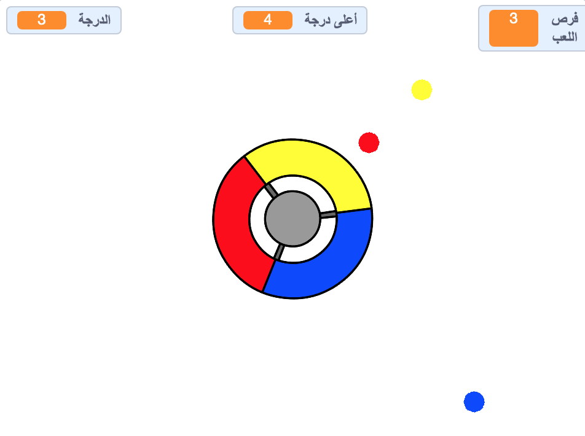

\--- no-print \---

هذا هو إصدار ** Scratch 3 ** من المشروع. هناك أيضًا [ إصدار Scratch 2 للمشروع ](https://projects.raspberrypi.org/en/projects/catch-the-dots-scratch2).

\--- /no-print \---

## المقدمة

في هذا المشروع ستتعلم كيفية إنشاء لعبة، حيث سيطلب من اللاعب مطابقة النقاط الملونة المتحركة مع اللون الصحيح المقابل على عجلة التحكم الدوارة.

\--- no-print \--- استخدم مفاتيح الأسهم على لوحة المفاتيح لتدوير عجلة التحكم و لإمساك النقاط الملونة الطائرة باتحاه عجلة التحكم. اذا اخطأت في توصيل ثلاث نقاط طائرة إلى اللون المقابل الصحيح، ستنتهي اللعبة.

  <iframe allowtransparency="true" width="485" height="402" src="https://scratch.mit.edu/projects/embed/252923761/?autostart=false" frameborder="0" scrolling="no"></iframe>
  

\--- /no-print \---

\--- print-only \---  \--- /print-only \---

## \--- collapse \---

## title: ما الذي ستتعلمه

+ كيفية اختيار عناصر عشوائية من قائمة
+ كيفية استخدام المتغيرات لتتبع السرعة، عدد مرات اللعب المتبقية،و درجة اللاعب

\--- /collapse \---

## \--- collapse \---

## title: ما ستحتاج إليه

### الأجهزة

+ جهاز كمبيوتر يدعم تشغيل برنامج Scratch 3

### البرمجيات

+ برنامج Scratch 3 (سواء أكان [عبر الإنترنت](http://rpf.io/scratchon){:target="_blank"} أو [دون اتصال بالإنترنت](http://rpf.io/scratchoff){:target="_blank"})

### للتحميل

+ [مشروع Scratch 3 للتحميل على جهاز الكومبيوتر ](http://rpf.io/p/en/catch-the-dots-go){:target="_blank"} \--- /collapse \---

## \--- collapse \---

## title: معلومات اضافية للمعلمين

\--- no-print \--- إذا كنت بحاجة إلى طباعة هذا المشروع، فيُرجى استخدام [النسخة القابلة للطباعة](https://projects.raspberrypi.org/en/projects/catch-the-dots/print). \--- /no-print \---

يمكنك [الحصول على المشروع كاملاً من هنا](http://rpf.io/p/en/catch-the-dots-get){:target="_blank"}.

يمكنك الحصول على [المشروع كاملاً من هنا](https://scratch.mit.edu/projects/252923761/#editor){:target="_blank \---