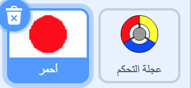
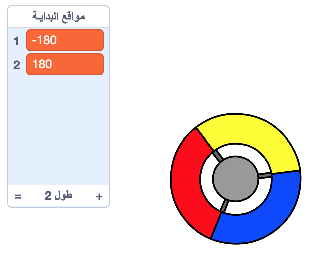
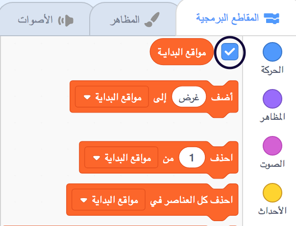
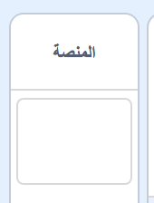

## احصل على نقاط أو اخسر حياة

الآن ستقوم بإضافة بعض النقاط التي سيحتاج اللاعب إلى جمعها.

\--- task \---

أنشئ كائن جديدًا يُسمى 'red'. يجب أن يكون هذا الكائن نقطة حمراء صغيرة.



\--- /task \---

\--- task \---

أضف هذا النص البرمجي للكائن 'أحمر' لإنشاء نسخة جديدة من هذا الكائن كل بضع ثوان:


```blocks3
    عند نقر ⚑
اختفِ
انتظر (2) ثانية
كرِّر باستمرار 
  أنشئ نسخة من (myself v)
  انتظر (عدد عشوائي بين (5) و (10)) ثانية
end
```

\--- /task \---

إذا نقرت على العلم الأخضر الآن، سيبدو لك أنه لا يحدث شيئاً. و هذا بسبب أن كل الكائنات المنسوخة مخفية، و كلها تظهر في نفس المكان.

ستقوم الآن بإضافة بعض التعليمات البرمجية لجعل كل نسخة جديدة تظهر على إحدى الزوايا الأربعة لمسرح العمل.


\--- task \---

أنشئ قائمة جديدة باسم `مواقع البداية`{:class="block3variables"}, انقر على ايقونة القوائم `(+)` لإضافة القيم `-180`{:class="block3variables"} و `180`{:class="block3variables"}.




[[[generic-scratch3-make-list]]]

بعد ذلك يمكنك إخفاء القائمة عن طريق إلغاء تحديد هذا المربع:



\--- /task \---

لاحظ أن إحداثيات كل ركن من أركان منصة العمل هو مجموعة من `180` و `-180`. هذا يعني أنه يمكنك استخدام القائمة لاختيار زاوية على منصة العمل بشكل عشوائي.

\--- task \---

أضف هذا النص البرمجي لكائن 'النقطة' لجعل كل نسخة جديدة تظهر على أحد زوايا منصة العمل بشكل عشوائي وبعدها تتحرك ببطئ بإتجاه كائن عجلة التحكم.


```blocks3
    عندما تبدأ نسخة مني
اذهب إلى الموضع س: (العنصر (عدد عشوائي بين (1) و (2)) من [start positions v]) ص: (العنصر (عدد عشوائي بين (1) و (2)) من [start positions v])
اتجه نحو (controller v)
اظهر
كرِّر حتى <touching (controller v)?> 
  تحرك (1) خطوة
end
```

\--- /task \---

هذا النص البرمجي الجديد يختار إما `-180` أو `180` لمواقع الاحداثيات س و ص, و هذا يعني أن كل نسخة من كائن 'النقطة' ستبدأ من زاوية على منصة العمل.

\--- task \---

اختبر مشروعك. يجب ان ترى الكثير من النقاط الحمراء تظهر في كل ركن من أركان منصة العمل ، وتتحرك ببطء نحو عجلة التحكم.


\--- /task \---

\--- task \---

أنشئ متغيرين جديدين أحدهما باسم `فرص اللعب`{:class="block3variables"} و الآخر باسم `الدرجة`{:class="block3variables"}. \--- /task"}.


\--- /task \---

\--- task \---

أضف بعض التعليمات البرمجية إلى مشروعك لتحديد قيمة متغير`فرص اللعب`{:class="block3variables"} إلى `3` و قيمة متغير `الدرجة`{:class="block3variables"} إلى `0` في بداية اللعبة. 

```blocks3
عند نقر ⚑
اجعل [فرص اللعب v] مساويًا (3)
اجعل [الدرجة v] مساويًا (0)
```

\--- /task \---

\--- task \---

أضف هذه التعليمة البرمجية في نهاية النص البرمجي للمشروع لجعل اللعبة تنتهي عندما يخسر اللاعب جميع فرص اللعب الثلاثة:


```blocks3
    انتظر حتى <(lives :: variables) <[1]>
    أوقف [all v]
```

\--- /task \---

على اللاعب أن يكسب درجات من خلال تجميعه للنقاط، و سيخسر فرص اللعب في حال فشل في تجميعها. يمكن الإمساك بالنقطة فقط في حال مطابقة لون جزء عجلة التحكم بلون النقطة.

\--- task \---

ارجع إلى منطقة المقاطع البرمجية الخاصة بكائن النقطة 'أحمر' لإضافة بعض التعليمات البرمجية في نهاية النص البرمجي`عندما تبدأ نسخة مني`{:class="block3control"} script.

أولاً, اجعل نسخة النقطة `تتحرك ٥ خطوة`{:class="block3motion"} بحيث تتداخل مع عجلة التحكم.

بعد ذلك أضف تعليمات برمجية لإضافة إما `1` إلى متغير`الدرجة`{:class="block3variables"} إذا كان لون نسخة النقطة يتطابق مع لون جزء عجلة التحكم عندما بتلامسان, أو لخصم `1` من متغير `فرص اللعب`{:class="block3variables"} إذا لم يتطابق اللونين.

[[[generic-scratch3-sound-from-library]]]


```blocks3
    تحرك (5) خطوة
إذا <touching color [#FF0000]?> 
  غيِّر [الدرجة v] بمقدار (1)
  شغِّل الصوت (pop v) وانتظر انتهاءه
وإلا 
  غيِّر [اللعب فرص v] بمقدار (-1)
  شغِّل الصوت (Laser1 v) وانتظر انتهاءه
end
احذف هذه النسخة
```

\--- /task \---

\--- task \---

اختبر لعبتك للتأكد من أن:

1. تفقد فرصة لعب في حال لم يتطابق لون النقطة مع اللون الصحيح من عجلة التحكم
2. تكسب نقطة إذا تطابقت النقطة بشكل صحيح

\--- /task \---