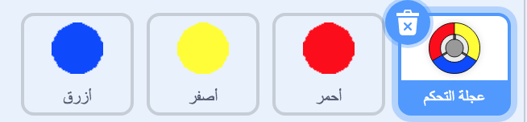
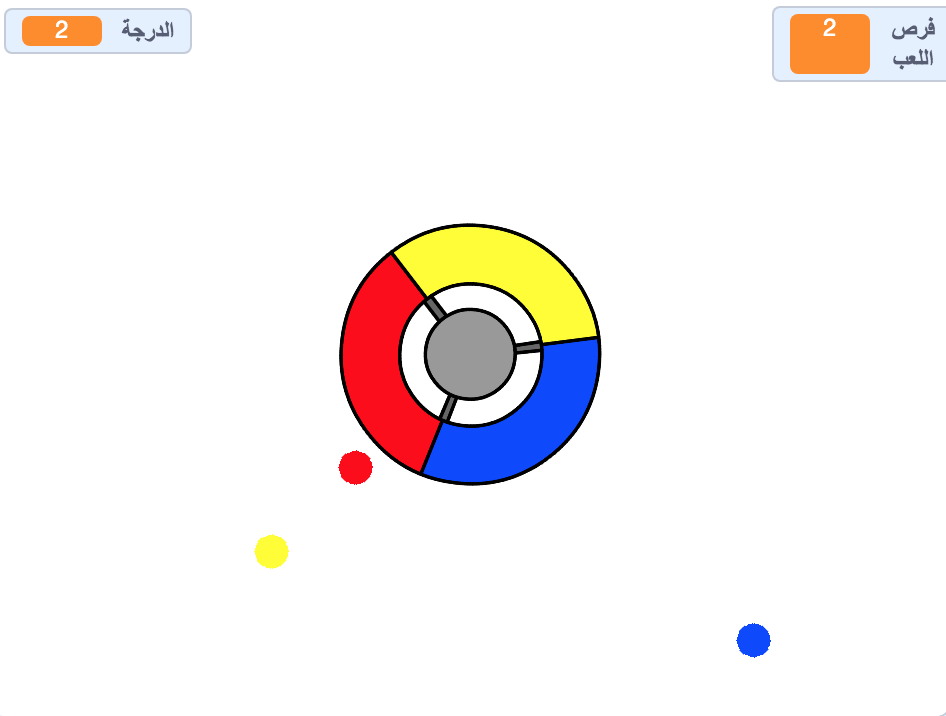

## جمع النقاط

\--- task \--- قم بمضاعفة كائن النقطة 'أحمر' مرتين، و أطلق على الكائنات الجديدة المسميات 'أصفر' و 'أزرق'.

 \--- /task \---

\--- task \--- غير مظهر الكائنات الجديدة بحيث يتناسب لون كلاً منهما مع اسمه: الكائن 'أصفر' لونه أصفر، و الكائن 'أزرق' لونه أزرق. \--- /task \---

\--- task \--- غيّر التعليمات البرمجية لكل كائن بحيث يصبح على اللاعب أن يطابق نسخ كائنات النقاط مع اللون المناسب على عجلة التحكم ليكسب نقاط.



\--- hints \--- \--- hint \--- هذه هي التعليمات البرمجية التي ستحتاج إلى تعديلها للكائنين الجديدين 'أصفر' و 'أزرق':


```blocks3
    إذا <touching color [#FF0000]?> 
  غيِّر [score v] بمقدار (1)
  ابدأ الصوت (pop v)
  . . .
end...
    النهاية
```

\--- /hint \--- \--- hint \--- فيما يلي ما ستحتاجه لتغيير التعليمات البرمجية الخاصة بالكائن أصفر:

```blocks3
    if <touching color [#FFFF00]? :: +> then
        change [score v] by (1)
        play sound (pop v)
    end
```

فيما يلي ما ستحتاجه لتغيير التعليمات البرمجية الخاصة بالكائن أزرق:

```blocks3
    if <touching color [#0000FF]? :: +> then
        change [score v] by (1)
        play sound (pop v)
    end
```

\--- /hint \--- \--- /hints \--- \--- /task \---

إذا قمت بتشغيل اللعبة الآن، ستشاهد أن النقاط الملونة يتم انشائها بعض الأحيان فوق بعضها البعض.

\--- task \--- عدّل على التعليمات البرمجية الخاصة بكائن النقطة 'أصفر' بحيث ينتظر ٤ ثوان بعد النقر على العلم الأخضر قبل أن يظهر على مسرح العمل.


```blocks3
    when flag clicked
    hide
+   wait (4) seconds
```


بعد ذلك عدّل على التعليمات البرمجية الخاصة بكائن النقطة 'أزرق' بحيث ينتظر ٦ ثوان بعد النقر على العلم الأخضر قبل أن يظهر على مسرح العمل.

\--- /task \---