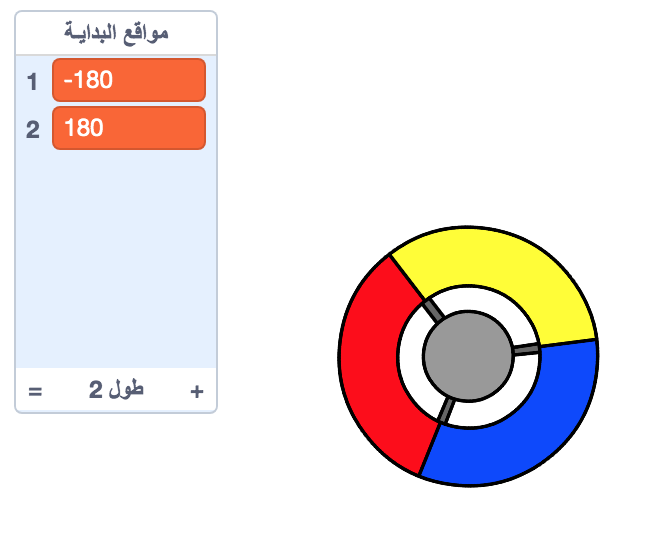

## جمع النقاط

لنضِف بعض النقاط ليجمعها اللاعب باستخدام القرص الدوَّار.


+ أنشئ كائنًا جديدًا يُسمى 'أحمر'. يجب أن يكون هذا الكائن نقطة حمراء صغيرة.

	

+ أضف هذا النص إلى كائن النقطة 'الحمراء'، لإنشاء نسخة نقطة جديدة كل بضع ثوان:

	```blocks
		عند نقر العلم
		أخف
		انتظر (2) ثانية
		كرِّر باستمرار
			أنشئ نسخة من [myself v]
			انتظر (اختر عشوائيًا من (5) إلى (10)) ثوانٍ
		أوقف المقطع البرمجي
	```

+ عند إنشاء كل نسخة، ستحتاج إلى أن تظهر النسخة في إحدى الزوايا الأربع للمنصة.

	

	لفعل ذلك، أنشئ أولاً __قائمة__ تُسمى `مواقع البدء`{:class="blockdata"} وانقر على `(+)` لإضافة القيمتَين `180-` و`180`.

	

+ يمكنك استخدام عنصرَي القائمة هذين لاختيار زاوية عشوائية للمنصة. أضف هذه التعليمة البرمجية إلى كائن 'النقطة'، بحيث تتحرك كل نسخة إلى زاوية عشوائية ثم تتحرك ببطء نحو القرص الدوَّار.

	```blocks
		عندما أبدأ كنسخة
		انتقل إلى x: (عنصر (عشوائي v) من [مواقع البدء v]) y: (عنصر (عشوائي v) من [مواقع البدء v])
		توجَّه نحو [القرص الدوَّار v]
		اظهر
		كرِّر حتى <يلامس [القرص الدوَّار v]؟>
			تحرك (1) خطوة
		أوقف المقطع البرمجي
	```

	تختار هذه التعليمة البرمجية `180-` أو `180` لموقعَي x _و_ y، وهو ما يعني أن كل نسخة تبدأ في إحدى زوايا المنصة.

+ اختبر مشروعك. سترى نقاطًا حمراء كثيرة تظهر في كل زاوية من زوايا الشاشة، ثم تتحرك ببطء نحو القرص الدوَّار.

	

+ أنشئ متغيرَين جديدَين أحدهما يُسمى `المحاولات`{:class="blockdata"} والآخر يُسمى `النتيجة`{:class="blockdata"}.

+ أضف تعليمة برمجية إلى منصتك لتعيين `المحاولات`{:class="blockdata"} إلى 3 وتعيين `النتيجة`{:class="blockdata"} إلى 0 في بداية كل لعبة.

+ تحتاج إلى إضافة تعليمة برمجية إلى نهاية التعليمة البرمجية `عندما أبدأ كنسخة`{:class="blockcontrol"} الخاصة بالنقطة الحمراء، بحيث يضاف 1 إلى `النتيجة`{:class="blockdata"} التي يحرزها اللاعب إذا تطابقت الألوان، أو يُطرح 1 من `المحاولات`{:class="blockdata"} المتاحة للاعب إذا لم تتطابق الألوان.

	```blocks
		تحرك (5) خطوة
		إذا <يلامس اللون [#FF0000]؟>
			فغيِّر [النتيجة v] بمقدار (1)
			شغِّل الصوت [pop v]
		وإلا
			فغيِّر [المحاولات v] بمقدار (1-)
			شغِّل الصوت [laser1 v]
		أوقف المقطع البرمجي
		احذف هذه النسخة
	```

+ أضف هذه التعليمة البرمجية إلى نهاية نص المنصة، بحيث تنتهي اللعبة عندما يخسر اللاعب كل المحاولات:

	```blocks
		انتظر حتى <(المحاولات) < [1]>
		أوقف [الكل v]
	```

+ اختبر لعبتك لتتأكد من أن التعليمة البرمجية تعمل بالشكل المطلوب.


