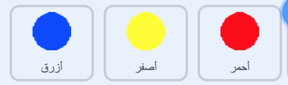

## زيادة مستوى الصعوبة

الآن ستقوم برفع مستوى صعوبة اللعبة كلما نجح اللاعب في اللعب لوقت أطول. ستقوم بعمل ذلك عن طريق جعل النقاط تظهر بشكل أسرع و أسرع مع مرور الوقت.

\--- task \---

Create a new `variable`{:class="block3variables"} called 'delay'.


\--- /task \---

\--- task \---

Go to the Stage's Scripts area and create a new script that sets the `delay`{:class="block3variables"} variable to `8` and then slowly reduces the value of `delay`{:class="block3variables"} while the game runs.


```blocks3
    عند نقر ⚑
اجعل [delay v] مساويًا (8)
كرِّر حتى <(delay) = (2)> 
  انتظر (10) ثانية
  غيِّر [delay v] بمقدار (-0.5)
end
```

\--- /task \---

Notice that this code is very similar to the code you would use to create a countdown timer!

Next, use the `delay`{:class="block3variables"} variable in the code scripts of the 'red', 'yellow', and 'blue' sprites.

\--- task \---

Remove the code block that makes the game wait a random number of seconds between making the dot sprite clones. Replace the block you've removed with your new `delay`{:class="block3variables"} variable:



```blocks3
<br />انتظر (عدد عشوائي بين (5) و (10)) ثانية
انتظر (تأخير :: variables) ثانية
```

Do this for all three dot sprites.

\--- /task \---

\--- task \---

Test the game, and check whether the dots begin to appear more quickly as the game goes on.

+ هل هذا الشيء متحقق مع جميع النقاط الثلاثة الملونة؟
+ Can you see that the value of the `delay`{:class="block3variables"} variable decreases?

\--- /task \---