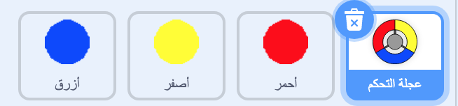

\--- challenge \---

## التحدي: المزيد من النقاط

قم بتكرار المتغير 'red' الخاص بك مرتين ، وأعطي اسم للمتغيرات الجديدة 'yellow' و 'blue'.

قم بتحرير هذه الكائنات (بما في ذلك التعليمات البرمجية الخاصة بها)، بحيث يجب أن تطابق كل نقطة ملونة اللون الصحيح على وحدة التحكم. تذكر أن تختبر مشروعك، وتأكد من أنك تكسب النقاط وتفقد الفرص (المحاولات) فوفقًا للتعليمات البرمجية التي أدخلتها، وأن لعبتك ليست سهلة أو صعبة للغاية!

\--- /challenge \---