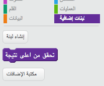

## أعلى نتيجة

ستقوم بحفظ أعلى درجة تم تحقيقها، بحيث يمكن للاعب معرفة مدى تقدمه.

\--- task \---

Create a new variable called `high score`{:class="block3variables"}.


\--- /task \---

\--- task \---

Select the Stage. Click on 'My blocks' and create a new custom block called `check high score`{:class="block3myblocks"}.




\---/task\---

\--- task \---

Add code to your custom block so that the block checks if the current value of `score`{:class="block3variables"} in larger than the value of the `high score`{:class="block3variables"} variable, and then stores the value of `score`{:class="block3variables"} as the new value of `high score`{:class="block3variables"}.


```blocks3
    عرِّف التحقق من أعلى درجة
إذا <(الدرجة :: variables) > (أعلى درجة)> 
  اجعل [أعلى درجة v] مساويًا (الدرجة :: variables)
end
```

\--- /task \---

\--- task \---

Add your new custom block to the Stage script before the end of the script.


```blocks3
عند نقر ⚑
اجعل [فرص اللعب v] مساويًا (3)
اجعل [الدرجة v] مساويًا (0)
انتظر حتى <(فرص اللعب) < (1)>
```

\--- /task \---

\--- task \---

Play your game twice to check whether your score gets correctly saved as the `high score`{:class="block3variables"}.

\--- /task \---