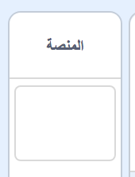
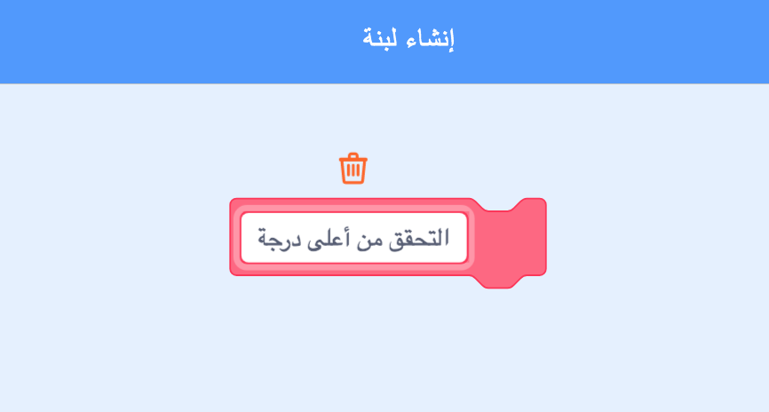

## أعلى نتيجة

ستقوم بحفظ أعلى درجة تم تحقيقها، بحيث يمكن للاعب معرفة مدى تقدمه.

\--- task \--- قم بإنشاء متغير جديد يسمى `أعلى درجة`{:class="block3variables"}.



\---/task--

\--- task \--- اختر مسرح العمل. انقر على 'لبناتي' و أنشئ لبنة جديدة تسمى `التحقق من أعلى درجة`{:class="block3myblocks"}.

 

\--- /task \---

\--- task \--- أضف تعليمات برمجية إلى اللبنة الجديدة التي أنشئتها بحيث تقوم بالتحقق ما إذا كانت القيمة الحالية للمتغير`الدرجة`{:class="block3variables"} أكبر من قيمة المتغير `أعلى درجة`{:class="block3variables"}, ثم بعد ذلك تقوم بحفظ قيمة `الدرجة`{:class="block3variables"} كالقيمة الجديدة للمتغير `أعلى درجة`{:class="block3variables"}.


```blocks3
    عرِّف التحقق من أعلى درجة
إذا <(الدرجة :: variables) > (أعلى درجة)> 
  اجعل [أعلى درجة v] مساويًا (الدرجة :: variables)
end
```

\---/task\---

\--- task \--- أضف اللبنة الجديدة للمقاطع البرمجية على مسرح العمل قبل نهاية النص البرمجي.


```blocks3
عند نقر ⚑
اجعل [فرص اللعب v] مساويًا (3)
اجعل [الدرجة v] مساويًا (0)
انتظر حتى <(فرص اللعب) < (1)>
```

\--- /task \---

\--- task \---

قم بتجربة اللعبة أكثر من مرة و تحقق مما إذا كانت الدرجة تحفظ بشكل صحيح في المتغير `أعلى درجة`{:class="block3variables"}.

\--- /task \---