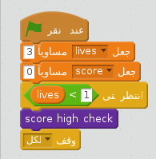

## أعلى نتيجة

دعونا نحفظ أعلى نتيجة، بحيث يمكن للاعبين رؤية مدى حسن أدائهم.

+ أولا ، إضافة متغيرًا جديدًا يُسمى `أعلى نتيجة`{:class="blockdata"}.

+ انقر على المنصة الخاصة بك ، وأنشئ لبنة مخصصة تُسمى `ابحث عن أعلى نتيجة`{:class="blockmoreblocks"}.
    
    

+ قبل نهاية اللعبة مباشرة، اللبنة المخصصة.
    
    

+ قم بإضافة التعليمة البرمجية إلى اللبنة المخصصة الخاصة بك لتخزين قيمة `النتيجة`{:class="blockdata"} الحالية `كـأعلى نتيجة`{:class="blockdata"} `إذا`{:class="blockcontrol"} هي أعلى نتيجة حتى الآن:
    
    ```blocks
        تعريف [check high score]
    إذا <(score) > (high score)> 
      اجعل [high score v] مساوياً (score)
    end
    ```

+ اختبر التعليمة البرمجية التي أضفتها. شغّل اللعبة للتحقق ما إذا كان `أعلى نتيجة`{:class="blockdata"} تم تحديثها بشكل صحيح.