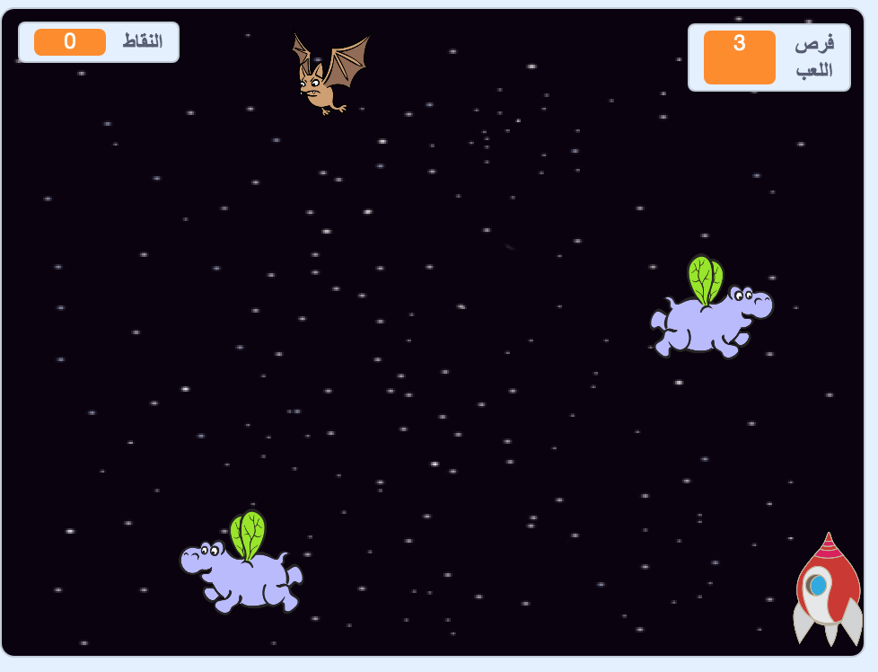

## ما التالي؟

جرب أن تطبق مشروع [حروب المستنسخين](https://projects.raspberrypi.org/ar-SA/projects/clone-wars?utm_source=pathway&utm_medium=whatnext&utm_campaign=projects)، حيث ستقوم بانشاء لعبة ستقوم من خلالها بحماية كوكب الأرض من وحوش الفضاء. في هذا المشروع، ستكون قادر على استخدام ما تعلمته مؤخراً عن إنشاء نسخ من الكائنات و إضافة نتيجة اللعب!

--- no-print ---

انقر على العلم الأخضر في شاشة اللعبة أدناه للبدء, ثم اضغط على مفاتيح الأسهم <kbd>يسار</kbd> و <kbd>يمين</kbd> لتحريك المركبة الفضائية، و مفتاح<kbd>المسافة</kbd> لإطلاق النار.

  <iframe allowtransparency="true" width="485" height="402" src="https://scratch.mit.edu/projects/embed/276887163/?autostart=false" frameborder="0" scrolling="no"></iframe>
  

--- /no-print ---

حقق أعلى عدد من النقاط عن طريق إطلاق النار على حيوانات فرس النهر الفضائية الطائرة. إذا تعرضت لإصابة من فرس نهر فضائي أو من برتقالة سقطت من الخفافيش، فستفقد فرصة لعب.

--- print-only ---

--- /print-only ---

***
تمت ترجمة هذا المشروع بواسطة متطوعين:

خلود محمد باسلم

نادية علي قاسم

علا محمد جزماتي

هند إبراهيم الداود

بفضل المتطوعين ، يمكننا إعطاء الناس في جميع أنحاء العالم فرصة للتعلم بلغتهم الخاصة. يمكنك مساعدتنا في الوصول إلى المزيد من الأشخاص من خلال التطوع للترجمة - مزيد من المعلومات على [rpf.io/translate](https://rpf.io/translate).