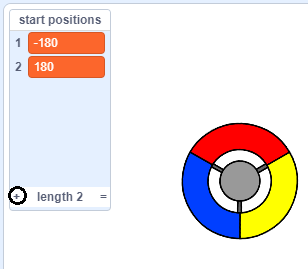

## পয়েন্ট অর্জন করুন বা জীবন হারান

এখন আপনি কিছু বিন্দু যুক্ত করতে যাচ্ছেন যা প্লেয়ারকে সংগ্রহ করতে হবে।.

--- task ---

'red' নামে একটি নতুন স্প্রাইট তৈরি করুন।. এই sprite টি একটি ছোট লাল বিন্দু হওয়া উচিত।.


--- /task ---

--- task ---

প্রতি কয়েক সেকেন্ডে sprite র একটি নতুন ক্লোন তৈরি করতে এই স্ক্রিপ্টটি আপনার 'red' স্প্রাইট এ যুক্ত করুন:


```blocks3
    when flag clicked
    hide
    wait (2) seconds
    forever
        create clone of (myself v)
        wait (pick random (5) to (10)) secs
    end
```

--- /task ---

আপনি যদি এখন সবুজ পতাকাটিতে ক্লিক করেন তবে দেখে মনেহবে কিছুই হচ্ছে না।. এটির কারণ হলো সমস্ত ক্লোন করা স্প্রাইটগুলি লুকানো রয়েছে এবং এগুলো একই স্থানে প্রদর্শিত হয়।.

আপনি প্রতিটি নতুন ক্লোন স্টেজের চারটি কোণে প্রদর্শিত করতে, code যুক্ত করতে যাচ্ছেন।.


--- task ---

নামে একটি নতুন তালিকা তৈরি করুন `start positions`{:class="block3variables"},তালিকায় ক্লিক করুন `(+)` icon to add the values `-180`{:class="block3variables"} এবং `180`{:class="block3variables"}.




[[[generic-scratch3-make-list]]]

তারপরে আপনি এই box টি নির্বাচন না করে তালিকাটি আড়াল করতে পারেন:


--- /task ---

লক্ষ্য করুন যে মঞ্চের প্রতিটি কোণার স্থানাঙ্কিটি ` 180 ` এবং ` -180 ` এর সংমিশ্রণ।. এর অর্থ আপনি এলোমেলোভাবে Stage এর যে কোনো কোনা বাছাই করতে তালিকাটি ব্যবহার করতে পারেন।.

--- task ---

প্রতিটি নতুন স্প্রাইট ক্লোনকে এলোমেলো ভাবে যে কোনো কোণে প্রদর্শিত করতে এবং তারপরে আস্তে আস্তে নিয়ামক স্প্রাইটের দিকে এগিয়ে যাওয়ার জন্য এই code টি 'dot' স্প্রাইটে যুক্ত করুন।.


```blocks3
    when I start as a clone
    go to x: (item (pick random (1) to (2)) of [start positions v]) y: (item (pick random (1) to (2)) of [start positions v])
    point towards (controller v)
    show
    repeat until <touching (controller v)?>
        move (1) steps
    end
```

--- /task ---

এই নতুন কোডটি x এবং y পজিশনের জন্য `-180` বা `180` বাছাই করে, যার অর্থ প্রতিটি 'dot' স্প্রাইট ক্লোন স্টেজের এক কোণে শুরু হয়।.

--- task ---

আপনার প্রজেক্ট পরীক্ষা করুন. আপনার Stage টির কোণে লাল বিন্দুগুলি দেখতে পাওয়া উচিত এবং নিয়ামকের দিকে ধীরে ধীরে অগ্রসর হওয়া উচিত।.


--- /task ---

--- task ---

এই নামে দুটি নতুন ভেরিয়েবল তৈরি করুন `lives`{:class="block3variables"} এবং `score`{:class="block3variables"}.


--- /task ---

--- task ---

গেমের শুরুতে `lives`{:class="block3variables"} ভেরিয়েবলটি `3` তে এবং `score`{:class="block3variables"} থেকে `0` তে. সেট করতে আপনার Stage এ code যুক্ত করুন. 

```blocks3
when flag clicked
set [lives v] to (3)
set [score v] to (0)
```

--- /task ---

--- task ---

খেলোয়াড় শেষ জীবন টি হারিয়ে ফেললে গেমটি শেষ করতে Stage এর স্ক্রিপ্টের শেষে এই code টি যুক্ত করুন:


```blocks3
    wait until <(lives :: variables) < [1]>
    stop [all v]
```

--- /task ---

খেলোয়াড়কে বিন্দু ধরার জন্য পয়েন্ট জিতবে এবং বিন্দু ধরতে ব্যর্থ হওয়ার জন্য প্রাণ হারানো উচিত।. একটি বিন্দু কেবলমাত্র নিয়ামকের রঙের সাথে বিন্দুর রঙের সাথে মিলিয়ে ধরা যায়।.

--- task ---

স্প্রাইটের `when I start as a clone`{:class="block3control"} স্ক্রিপ্ট এর শেষের দিকে কিছু code ব্লক যুক্ত করতে 'red' ডট স্প্রাইটের স্ক্রিপ্টগুলি অঞ্চলে ফিরে যান.

প্রথমে, ডট ক্লোনটি তৈরি করুন `move 5 steps`{:class="block3motion"} যাতে এটি নিয়ামককে ওভারল্যাপ করে।.

তারপর code যোগ করতে পারেন `1` কে `score`{:class="block3variables"} তে যোগ করতে,যদি ডট ক্লোন রঙ নিয়ামক যখন তারা স্পর্শ, অথবা নিতে রঙ মিলে যায়, অথবা `1` কে `lives`{:class="block3variables"} থেকে সরিয়ে নিতে পারেন যদি তাদের রঙ মেলে না।.

[[[generic-scratch3-sound-from-library]]]


```blocks3
    move (5) steps
    if <touching color [#FF0000]?> then
        change [score v] by (1)
        play sound (pop v) until done
    else
        change [lives v] by (-1)
        play sound (Laser1 v) until done
    end
    delete this clone
```

--- /task ---

--- task ---

আপনার গেমটি পরীক্ষা করে দেখুন তা নিশ্চিত করুন:

1. আপনি যদি সঠিক রঙের সাথে কোনও বিন্দুর সাথে না মেলাতে না পারেন তবে আপনি একটি জীবন হারাবেন
2. আপনি যদি একটি বিন্দুটি সঠিকভাবে মেলান তবে আপনি একটি পয়েন্ট স্কোর করবেন

--- /task ---