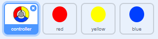

## আরও বিন্দু

--- task ---

আপনার 'red' ডট স্প্রিটকে দুবার নকল করুন, এবং দুটি নতুন স্প্রিটের নাম 'yellow' এবং 'blue' দিন।.



--- /task ---

--- task ---

প্রতিটি নতুন স্প্রাইটের কস্টিউম পরিবর্তন করুন যাতে এটি সঠিক রঙ হয়: 'yellow' স্প্রিটটি হলুদ হতে হবে এবং 'blue' স্প্রাইটটি নীল হতে হবে।.

--- /task ---

--- task ---

প্রতিটি স্প্রাইটের code টি পরিবর্তন করুন যাতে প্লেয়ারকে কন্ট্রোলারে পয়েন্ট করতে ডট ক্লোনটি সঠিক রঙের সাথে মেলাতে হয়।.


--- hints ---


--- hint ---

এই কোডটিকে দুটি নতুন স্প্রাইটের জন্য অনুসন্ধান এবং পরিবর্তন করতে হবে:


```blocks3
    if <touching color [#FF0000]?> then
        change [score v] by (1)
        play sound (pop v)
        ...
    end
```

--- /hint ---

--- hint ---

হলুদ স্প্রাইটের জন্য আপনাকে এইভাবে কোডটি পরিবর্তন করতে হবে:

```blocks3
    if <touching color [#FFFF00]? :: +> then
        change [score v] by (1)
        play sound (pop v)
    end
```

নীল স্প্রাইটের জন্য আপনাকে এইভাবে কোডটি পরিবর্তন করতে হবে:

```blocks3
    if <touching color [#0000FF]? :: +> then
        change [score v] by (1)
        play sound (pop v)
    end
```

--- /hint ---

--- /hints ---

--- /task ---

আপনি যদি এখন গেমটি খেলেন তবে দেখতে পাবেন যে বিন্দুগুলি কখনও কখনও একে অপরের উপরে তৈরি হয়.

--- task ---

'হলুদ' ডট স্প্রাইটের জন্য কোডটি পরিবর্তন করুন যাতে পতাকাটি উপস্থিত হওয়ার আগে ক্লিক করার পরে এটি চার সেকেন্ড অপেক্ষা করে।.


```blocks3
    when flag clicked
    hide
+   wait (4) seconds
```


তারপরে 'blue' ডট স্প্রাইটের কোডটি পরিবর্তন করুন যাতে পতাকাটি উপস্থিত হওয়ার আগে ক্লিক করার পরে এটি 6 সেকেন্ড অপেক্ষা করে।.

--- /task ---