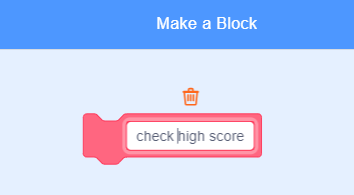

## উচ্চ স্কোর

আপনি গেমের উচ্চ স্কোরটি সংরক্ষণ করতে যাচ্ছেন, যাতে খেলোয়াড়রা দেখতে পান যে তারা কতটা ভাল করছে।.

--- task ---

`high score`{:class="block3variables"} নামে একটি নতুন ভেরিয়েবল তৈরি করুন}.


--- /task ---

--- task ---

মঞ্চটি নির্বাচন করুন।. 'My blocks' এ ক্লিক করুন এবং এই নামে `check high score`{:class="block3myblocks"} একটি নতুন কাস্টম ব্লক তৈরি করুন.




--- /task ---

--- task ---

আপনার কাস্টম ব্লকে code যুক্ত করুন যাতে ব্লকটি `score`{:class="block3variables"} এর বর্তমান মানটি `high score`{:class="block3variables"} ভ্যারিয়েবল এর উচ্চ স্কোরের চেয়ে বড়, এবং তারপরে `high score`{:class="block3variables"} এর নতুন মান হিসাবে `score`{:class="block3variables"} মান সংরক্ষণ করে.।.


```blocks3
    define check high score
    if <(score :: variables) > (high score)> then
        set [high score v] to (score :: variables)
    end
```

--- /task ---

--- task ---

স্ক্রিপ্ট শেষ হওয়ার আগে আপনার নতুন কাস্টম ব্লকটি স্টেজ স্ক্রিপ্টে যুক্ত করুন।.


```blocks3
when flag clicked
set [lives v] to (3)
set [score v] to (0)
wait until <(lives) < (1)>

+ check high score :: custom
stop [all v]
```

--- /task ---

--- task ---

আপনার স্কোরটি `high score`{:class="block3variables"} হিসাবে সঠিকভাবে সংরক্ষণ হয় কিনা তা পরীক্ষা করতে আপনার গেমটি দু'বার খেলুন}.

--- /task ---