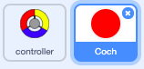
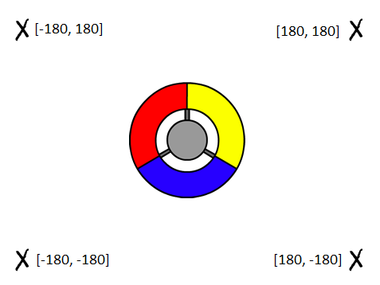
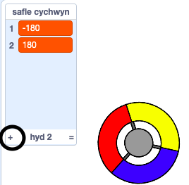

## Ennill pwyntiau neu cholli bywydau

Fe wnawn ni ychwanegu dotiau i’r chwareuwr eu casglu gyda’r rheolwr.

\--- task \--- Bydd angen creu corlun newydd o’r enw ‘coch’. Fe ddylai’r ciplun yma fod yn ddot bach coch.



\--- /task \---

\--- task \--- Ychwanega’r sgript yma i dy giplun dot ‘coch’, i greu clôn bob ychydig o eiliadau:


```blocks3
    when flag clicked
    hide
    wait (2) seconds
    forever
        create clone of (myself v)
        wait (pick random (5) to (10)) secs
    end
```

\--- /task \---

Os wyt ti'n clicio'r faner werdd nawr, mae'n edrych fel nad oes dim byd yn digwydd. Mae hyn gan fod yr holl gloniau wedi eu cuddio, ac yn ymddangos yn yr un man.

Rwyt ti mynd i ychwanegu côd i wneud i bob clôn ymddangos ymhob un cornel o'r Llwyfan.



I wneud hyn, bydd angen yn gyntaf creu rhestr o’r enw `safle cychwyn`{:class="block3variables"} a chlicio'r eicon `(+)` yn y rhestr i ychwanegu `-180`{:class="block3variables"} a `180`{:class="block3variables"}.




[[[generic-scratch3-make-list]]]

Fe alli di guddio'r rhestr trwy ddad-glicio'r bocs yma:

 \--- /task \---

Sylwa fod y cyfesur ar gyfer pob cornel o'r llwyfan yn gyfuniad o `180` a `-180`. Mae hyn yn golygu dy fod yn gallu dewis y rhestr i ddewis cornel o'r Llwyfan ar hap.

\--- task \--- Ychwanega’r côd yma i’r ciplun ‘dot’, fel bod pob clôn newydd yn symud i gornel ar hap ac yna’n symud yn araf tuag at y rheolwr.


```blocks3
    when I start as a clone
    go to x: (item (pick random (1) to (2)) of [start positions v]) y: (item (pick random (1) to (2)) of [start positions v])
    point towards (controller v)
    show
    repeat until <touching (controller v)?>
        move (1) steps
    end
```

Mae’r côd uchod unai yn dewis `-180` neu `180` ar gyfer safle yr x a y, sy’n golygu bod pob clôn yn cychwyn yn un cornel o’r llwyfan.

\--- task \--- Profa dy brosiect. Fe ddyle ti weld llawer o ddotiau coch yn ymddangos ymhob cornel o’r sgrin, ac yn symud yn araf tuag at y rheolwr.

 \--- /task \---

Bydd angen creu 2 newidyn newydd o’r enw `bywydau`{:class="block3variables"} a `sgôr`{:class="block3variables"}.

 \--- /task \---

Ychwanega côd i dy lwyfan i osod y newidyn `bywydau`{:class="block3variables"} i `3` a’r `sgôr`{:class="block3variables"} i `0` ar ddechrau’r gêm. 

```blocks3
when flag clicked
set [lives v] to (3)
set [score v] to (0)
```

\--- /task \---

Ychwanega'r côd yma i ddiwedd sgript y Llwyfan i wneud i'r gêm orffen pan mae'r chwareuwr yn colli'r bywydau olaf:


```blocks3
    wait until <(lives :: variables) < [1]>
    stop [all v]
```

\--- /task \---

Fe ddylai'r chwareuwr ennill pwyntiau ar gyfer dal dotiau, a cholli bywydau am fethu â dal dotiau. Yr unig ffordd i ddal dot yw ei fod yn gweddu'r un lliw â'r rheolwr.

Cer yn ôl i Sgriptiau'r corlun dot 'coch' i ychwanegu blociau côd i ddiwedd y sgript `pan dechreuaf fel clôn`{:class="block3control"}.

Yn gyntaf, gwna i'r clôn `symud 5 cam`{:class="block3motion"} fel ei fod yn gorgyffwrdd y rheolwr.

Yna ychwanega gôd i unai ychwanegu `1` i'r `sgôr`{:class="block3variables"} os yw lliw y dot yr un peth â lliw y rheolwr pan maent yn cyffwrdd, neu cymryd `1` i ffwrdd o'r `bywydau`{:class="block3variables"} os nad yw'r lliwiau yr un peth.

[[[generic-scratch3-sound-from-library]]]


```blocks3
    move (5) steps
    if <touching color [#FF0000]?> then
        change [score v] by (1)
        play sound (pop v) until done
    else
        change [lives v] by (-1)
        play sound (Laser1 v) until done
    end
    delete this clone
```

\--- /task \---

\--- task \---

Test your game to make sure that:

1. You lose a life if you don’t match a dot with the correct colour
2. You score a point if you match a dot correctly

\--- /task \---