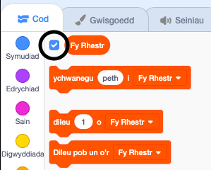

## Ennill pwyntiau neu cholli bywydau

Fe wnawn ni ychwanegu dotiau i’r chwareuwr eu casglu gyda’r rheolwr.

\--- task \---

Create a new sprite called 'red'. This sprite should be a small red dot.


\--- /task \---

\--- task \---

Add this script to your 'red' sprite to create a new clone of the sprite every few seconds:


```blocks3
    pan fo'r flag werdd yn cael ei glicio
cuddio
aros (2) eiliad
am byth 
  creu clôn o (myself v)
  aros (dewis ar hap (5) i (10)) eiliad
end
```

\--- /task \---

If you click the green flag now, it looks like nothing is happening. This is because all of the cloned sprites are hidden, and they appear in the same place.

You are going to add code to make each new clone appear in one of the four corners of the Stage.


\--- task \---

Create a new list called `start positions`{:class="block3variables"}, click the list's `(+)` icon to add the values `-180`{:class="block3variables"} and `180`{:class="block3variables"}.


[[[generic-scratch3-make-list]]]

Then you can hide the list by unselecting this box:



\--- /task \---

Notice that the coordinate for each corner of the Stage is a combination of `180` and `-180`. This means you can use the list to pick a corner of the Stage at random.

\--- task \---

Add this code to the 'dot' sprite to make each new sprite clone appear in a random corner and then slowly move towards the controller sprite.


```blocks3
    pan rwy'n dechrau fel clôn
mynd i x: (eitem (dewis ar hap (1) i (2)) o [safle cychwyn v]) y: (eitem (dewis ar hap (1) i (2)) o [safle cychwyn v])
pwyntio tuag at (controller v)
dangos
ailadrodd hyd at <cyffwrdd (controller v) ?> 
  symud (1) cam
end
```

\--- /task \---

This new code chooses either `-180` or `180` for the x and y positions, meaning that each 'dot' sprite clone starts in a corner of the Stage.

\--- task \---

Test your project. You should see red dots appear in the corners of the Stage and move slowly towards the controller.


\--- /task \---

\--- task \---

Create two new variables called `lives`{:class="block3variables"} and `score`{:class="block3variables"}.


\--- /task \---

\--- task \---

Add code to your Stage to set the `lives`{:class="block3variables"} variable to `3` and the `score`{:class="block3variables"} to `0` at the start of the game. 

```blocks3
pan fo'r flag werdd yn cael ei glicio
gosod [bywydau v] i (3)
gosod [sgôr v] i (0)
```

\--- /task \---

\--- task \---

Add this code to the end of the Stage's script to make the game end when the player loses the last of the lives:


```blocks3
    aros hyd at <(bywydau :: variables) < [1]>
aros [all v]
```

\--- /task \---

The player should win points for catching dots, and should lose lives for failing to catch dots. A dot can only be caught by matching the colour of the controller to the colour of the dot.

\--- task \---

Go back to the 'red' dot sprite's Scripts area to add some code blocks to the end of the sprite's `when I start as a clone`{:class="block3control"} script.

First, make the dot clone `move 5 steps`{:class="block3motion"} so that it overlaps the controller.

Then add code to either add `1` to `score`{:class="block3variables"} if the colour of the dot clone matches the colour of the controller when they touch, or to take `1` away from `lives`{:class="block3variables"} if their colours don't match.

[[[generic-scratch3-sound-from-library]]]


```blocks3
    symud (5) cam
os <cyffwrdd lliw [#FF0000] ?> yna 
  newid [sgôr v] gan (1)
  chwarae sain (pop v) tan y diwedd
fel arall 
  newid [bywydau v] gan (-1)
  chwarae sain (Laser1 v) tan y diwedd
end
dileu y clôn hwn
```

\--- /task \---

\--- task \---

Test your game to make sure that:

1. Chi’n colli bywyd os nad ydych yn paru â dot gyda’r lliw cywir
2. Chi’n sgorio pwynt os ydych yn paru â dot yn gywir

\--- /task \---