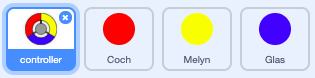
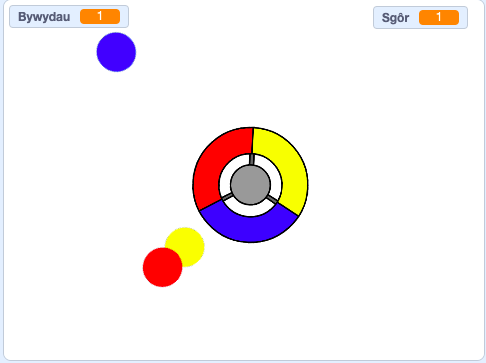

## Mwy o ddotiau

\--- task \--- Dyblyga’r ciplun dot ‘coch’ ddwywaith, a galwa’r cipluniau newydd yn ‘melyn’ a ‘glas’.

 \--- /task \---

\--- task \--- Newida gwisg pob corlun newydd fel eu bod y lliw cywir: fe ddylai'r corlun 'melyn' fod yn felyn, a'r corlun 'glas' fod yn las. \--- /task \---

\--- task \--- Newida côd pob corlun fel bod y chwareuwr yn gorfod gweddu lliw y dot â’r lliw cywir ar y rheolwr.



\--- hints \--- \--- hint \--- Dyma'r côd sydd ei angen ar gyfer dod o hyd a golygu'r corluniau newydd:


```blocks3
    os <cyffwrdd lliw [#FF0000] ?> yna 
  newid [sgôr v] gan (1)
  cychwyn sain (pop v)
  . . .
    end
```

\--- /hint \--- \--- hint \--- Dyma sut wyt ti'n newid y côd ar gyfer y corlun melyn:

```blocks3
    if <touching color [#FFFF00]? :: +> then
        change [score v] by (1)
        play sound (pop v)
    end
```

Dyma sut wyt ti'n newid y côd ar gyfer y corlun glas:

```blocks3
    if <touching color [#0000FF]? :: +> then
        change [score v] by (1)
        play sound (pop v)
    end
```

\--- /hint \--- \--- /hints \--- \--- /task \---

Os wyt ti'n chwarae'r gêm nawr, fe weli di fod y dotiau weithiau yn cael eu creu un ar ben y llall.

\--- task \--- Newida'r côd ar gyfer y dot 'melyn' fel ei fod yn aros pedair eiliad ar ôl i'r faner gael ei glicio cyn ymddangos.


```blocks3
    when flag clicked
    hide
+   wait (4) seconds
```


Yna newida côd y dot 'glas' fel ei fod yn aros 6 eiliad ar ôl i'r faner gael ei glicio cyn ymddangos.

\--- /task \---