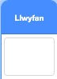
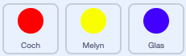

## Gwneud y gêm yn anoddach

Fe wnawn ni wneud y gêm i fynd yn anoddach yr hirach mae’r chwareuwr yn ei chwarae. Rwyt ti am wneud hyn gan wneud i'r dotiau ymddangos yn gynt ac yn gynt dros amser.

\--- task \---

Create a new `variable`{:class="block3variables"} called 'delay'.



\--- /task \---

\--- task \---

Go to the Stage's Scripts area and create a new script that sets the `delay`{:class="block3variables"} variable to `8` and then slowly reduces the value of `delay`{:class="block3variables"} while the game runs.


```blocks3
    pan fo'r flag werdd yn cael ei glicio
gosod [oedi v] i (8)
ailadrodd hyd at <(oedi) = (2)> 
  aros (10) eiliad
  newid [oedi v] gan (-0.5)
end
```

\--- /task \---

Notice that this code is very similar to the code you would use to create a countdown timer!

Next, use the `delay`{:class="block3variables"} variable in the code scripts of the 'red', 'yellow', and 'blue' sprites.

\--- task \---

Remove the code block that makes the game wait a random number of seconds between making the dot sprite clones. Replace the block you've removed with your new `delay`{:class="block3variables"} variable:



```blocks3
<br />aros (dewis ar hap (5) i (10)) eiliad
aros (oedi :: variables) eiliad
```

Do this for all three dot sprites.

\--- /task \---

\--- task \---

Test the game, and check whether the dots begin to appear more quickly as the game goes on.

+ Ydy hyn yn gweithio ar gyfer y tri lliw?
+ Can you see that the value of the `delay`{:class="block3variables"} variable decreases?

\--- /task \---