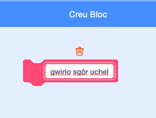

## Sgôr Uchel

Rwyt ti am arbed y sgôr uchel fel bod y chwareuwyr yn gwybod pa mor dda maent yn ei wneud.

--- task ---
Creu newidyn newydd o'r enw `sgôr uchel`{:class="block3variables"}.


--- /task ---

--- task --- Dewisa'r Llwyfan. Clicia 'Mwy o flociau' a chreu bloc newydd o’r enw `gwirio sgôr uchel`{:class="block3myblocks"}.

 

--- /task ---

--- task ---
Ychwanega côd i dy floc newydd i wirio os yw'r `sgôr`{:class="block3variables"} cyfredol yn fwy na'r newidyn `sgôr uchel`{:class="block3variables"}, ac yna storio gwerth y `sgôr`{:class="block3variables"} fel gwerth newydd `sgôr uchel`{:class="block3variables"}.


```blocks3
    diffinio gwirio sgôr uchel
os <(sgôr :: variables) > (sgôr uchel)> yna 
  gosod [sgôr uchel v] i (sgôr :: variables)
end
```

--- /task ---

--- task ---
Ychwanega bloc newydd i sgript y Llwyfan cyn ddiwedd y sgript.


```blocks3
pan fo'r flag werdd yn cael ei glicio
gosod [bywydau v] i (3)
gosod [sgôr v] i (0)
aros hyd at <(bywydau) < (1)>
+ gwirio sgôr uchel :: custom
aros [y cyfan v]
```

--- /task ---

--- task ---

Chwarae dy gêm i weld os yw dy `sgôr uchel`{:class="block3variables"} wedi ei ddiweddaru’n gywir.

--- /task ---