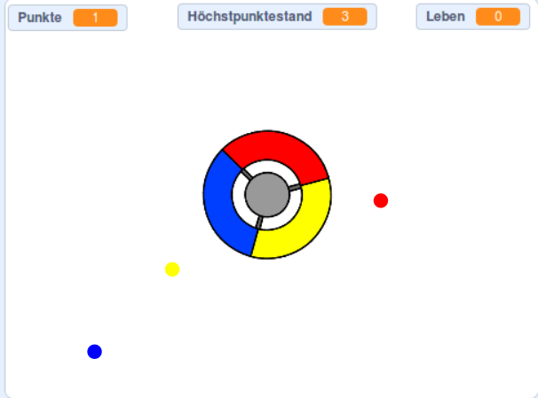

\--- no-print \---

Dies ist die **Scratch 3** Version des Projekts. Es gibt auch eine [Scratch 2-Version des Projekts](https://projects.raspberrypi.org/en/projects/catch-the-dots-scratch2).

\--- /no-print \---

## Einleitung

In diesem Projekt lernst Du, wie Du ein Spiel erstellst, bei dem der Spieler farbige Punkte mit der korrekten Farbe des Controller-Rads abgleichen muss.

\--- no-print \---

Use the arrow keys on your keyboard to rotate the controller wheel and catch the flying dots as they reach the centre. If you miss three dots, the game is over.

  <iframe allowtransparency="true" width="485" height="402" src="https://scratch.mit.edu/projects/embed/252923761/?autostart=false" frameborder="0" scrolling="no"></iframe>
  

\--- /no-print \---

\--- print-only \---

\--- /print-only \---

## \--- collapse \---

## title: Was du lernen wirst

+ Zufällige Elemente aus einer Liste auswählen
+ Wie man Variablen verwendet, um Geschwindigkeit, Leben und die Punktzahl des Spielers zu verfolgen

\--- /collapse \---

## \--- collapse \---

## title: Was du brauchen wirst

### Hardware

+ Ein Computer, auf dem Scratch 3 ausgeführt werden kann

### Software

+ Scratch 3 (entweder [online](http://rpf.io/scratchon){:target="_blank"} oder [offline](http://rpf.io/scratchoff){:target="_blank"})

### Downloads

+ [Offline Scratch 2 project](http://rpf.io/p/en/catch-the-dots-go){:target="_blank"}

\--- /collapse \---

## \--- collapse \---

## title: Zusätzliche Hinweise für Pädagogen

\--- no-print \---

If you need to print this project, please use the [printer-friendly version](https://projects.raspberrypi.org/en/projects/catch-the-dots/print).

\--- /no-print \---

You can find [the completed project here](http://rpf.io/p/en/catch-the-dots-get){:target="_blank"}.

You can find the [completed project here](https://scratch.mit.edu/projects/252923761/#editor){:target="_blank"}

\--- /collapse \---