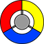

## Erstellen Sie einen Controller

Erstellen Sie zunächst einen Controller, den der Spieler zum Sammeln von Punkten verwenden soll.

\--- task \--- Öffnen Sie das Scratch-Starterprojekt 'Catch the dots'.

**Online:** Öffnen Sie das Starterprojekt um [rpf.io/dots-on](http://rpf.io/dots-on){: target = "_ blank"}. Wenn Sie über ein Scratch-Konto verfügen, können Sie auf **Remix** oben rechts klicken, um eine Kopie des Projekts zu speichern.

**Offline:** Laden Sie das Starterprojekt von [rpf.io/p/en/catch-the-dots-go](http://rpf.io/p/en/catch-the-dots-go)herunter und öffnen Sie es im Scratch-Offline-Editor.

Wenn Sie den Scratch-Offline-Editor herunterladen und installieren müssen, finden Sie ihn unter [rpf.io/scratchoff](http://rpf.io/scratchoff).

\--- / Aufgabe \---

Sie sollten ein Controller-Sprite sehen:


\--- task \--- Fügen Sie dem Controller-Sprite Code hinzu, damit das Sprite nach rechts dreht, wenn der Spieler die rechte Pfeiltaste drückt:



```blocks3
    wenn die Fahne für immer auf
    geklickt wurde
        wenn <key (right arrow v) pressed?> dann
            rechts (3) Grad
        Ende
    Ende
```

\--- / Aufgabe \---

\--- Aufgabe \--- Testen Sie Ihren Code. Der Controller sollte sich nach rechts drehen, wenn Sie die rechte Pfeiltaste drücken. \--- / Aufgabe \---

\--- task \--- Fügen Sie dem Controller-Sprite Code hinzu, damit das Sprite nach links dreht, wenn der Spieler die linke Pfeiltaste drückt.


\--- Hinweise \--- \--- Hinweis \---

Suchen Sie den Code, der überprüft, ob die rechte Pfeiltaste gedrückt wird, und das Sprite nach rechts dreht. Kannst du eine Kopie dieses Codes hinzufügen und die Kopie so ändern, dass geprüft wird, ob die linke Pfeiltaste gedrückt wird und das Sprite nach links dreht?

\--- / Hinweis \--- \--- Hinweis \--- Hier sind die Blöcke, die Sie brauchen:

```blocks3
<key (space v) pressed?>

links abbiegen (15) grad

wenn <> dann

ende
```

\--- / Hinweis \--- \--- Hinweis \--- So sollte Ihr Code aussehen:

```blocks3
    wenn die Fahne für immer auf
    geklickt wurde
        wenn <key (right arrow v) pressed?> dann
            rechts abbiegen (3) Grad
        Ende

+ Wenn <key (left arrow v) pressed?> dann
            links abbiegen (3) Grad
        Ende
    Ende
```

\--- / Hinweis \--- \--- / Hinweise \--- \--- / Aufgabe \---