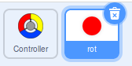
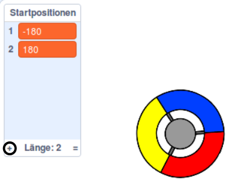
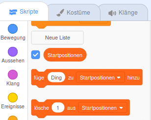

## Punkte sammeln oder Leben verlieren

Jetzt fügst du einige Punkte hinzu, die der Spieler sammeln muss.

\--- task \--- Erstelle eine neue Figur mit dem Namen 'rot'. Diese Figur sollte ein kleiner roter Punkt sein.



\--- /task \---

\--- task \--- Füge dieses Skript zu deiner 'roten' Figur hinzu, um alle paar Sekunden einen neuen Klon der Figur zu erstellen:


```blocks3
    Wenn die Flagge angeklickt wird
    verstecke dich
    warte (2) Sekunden
    wiederhole fortlaufend
        erzeuge einen Klon von (mir selbst v)
        warte (Zufallszahl von (5) bis (10)) Sekunden
    Ende
```

\--- /task \---

Wenn du jetzt auf die grüne Flagge klickst, scheint nichts zu passieren. Das liegt daran, dass alle geklonten Figuren versteckt sind und an derselben Stelle erscheinen werden.

Du wirst Code hinzufügen, damit jeder neue Klon in einer der vier Ecken der Bühne erscheinen wird.


\--- task \--- Erstelle eine neue Liste mit der Bezeichnung `Startpositionen`{:class="block3variables"}. Klicke auf das `(+)`-Symbol der Liste, um die Werte `-180`{:class="block3variables"} und `180`{:class="block3variables"} hinzuzufügen.




[[[generic-scratch3-make-list]]]

Dann kannst du die Liste ausblenden, indem du das Kontrollkästchen deaktivierst:

 \--- /task \---

Beachte, dass die Koordinate für jede Ecke der Bühne eine Kombination aus `180` und `-180` ist. Dies bedeutet, dass du die Liste verwenden kannst, um eine Ecke der Bühne zufällig auszuwählen.

\--- task \--- Füge diesen Code zur 'rot'-Figur hinzu, damit jeder neue Figuren-Klon in einer zufälligen Ecke erscheint und sich dann langsam in Richtung der Controller-Figur bewegt.


```blocks3
    Wenn ich als Klon entstehe
gehe zu x: (Element (Zufallszahl von (1) bis (2)) von [Startpositionen v]) y: (Element ( Zufallszahl von (1) bis (2)) von [Startpositionen v])
    drehe dich zu (Controller v)
    zeige dich
    wiederhole bis <wird (Controller v) berührt?>
        gehe (1) er Schritt
    Ende
```

\--- /task \--- Dieser neue Code wählt entweder `-180` oder `180` für die x- und y-Position, was bedeutet, dass jeder Punkt-Figur-Klon in einer Ecke der Bühne beginnt.

\--- task \--- Teste dein Projekt. Du solltest rote Punkte in den Ecken der Bühne entstehen sehen, die sich langsam in Richtung Controller bewegen.

 \--- /task \---

\--- task \--- Erstelle zwei neue Variablen mit den Namen `Leben`{:class="block3variables"} und `Punkte`{:class="block3variables"}.

 \--- /task \---

\--- task \--- Füge der Bühne Code hinzu, um zu Beginn des Spiels die Variable `Leben`{:class="block3variables"} auf `3` und die Variable `Punkte`{:class="block3variables"} auf `0` zu setzen. 

```blocks3
Wenn die Flagge angeklickt wird
setze [Leben v] auf (3)
setze [Punkte v] auf (0)
```

\--- /task \---

\--- task \--- Füge diesen Code am Ende des Bühnen-Skripts hinzu, damit das Spiel endet, wenn der Spieler das letzte Leben verliert:


```blocks3
    warte bis <(Leben :: Variablen) < [1]>
    stoppe [alles v]
```

\--- /task \---

Der Spieler sollte Punkte für das Fangen von Punkt-Figuren gewinnen und er sollte ein Leben verlieren, wenn er einen Punkt nicht fangen konnte. Ein Punkt kann nur gefangen werden, wenn die Farbe des Controllers und die Farbe des Punkts gleich sind.

\--- task \--- Kehre zum Script-Bereich der 'roten' Punkt-Figur zurück, um einige Codeblöcke am Ende des `wenn ich als Klon entstehe`{:class="block3control"}-Blocks anzufügen.

Zuerst mußt du den Punktklon `5 Schritte`{:class="block3motion"} weiter bewegen, sodass er den Controller überlappt.

Füge dann Code hinzu, um entweder `1` zu `Punkte`{:class="block3variables"} zu addieren, wenn die Farbe des Punktklons bei Berührung mit der Farbe des Controllers übereinstimmt, oder ziehe `1` von `Leben.`{:class="block3variables"} ab, wenn ihre Farben nicht übereinstimmen.

[[[generic-scratch3-sound-from-library]]]


```blocks3
    gehe (5) er Schritt
falls <wird Farbe [#FF0000] berührt?> dann
    ändere [Punkte v] um (1)
    spiele Klang (Plopp v) ganz
sonst
    ändere [Leben v] um (-1)
    spiele Klang (Laser1 v) ganz
Ende
lösche diesen Klon
```

\--- /task \---

\--- task \---

Teste dein Spiel und kontrolliere ob:

1. Du ein Leben verlierst, wenn die Farbe des Punktes nicht mit der Farbe des Controllers übereinstimmt
2. Du eine Punkt bekommst, wenn die Farben richtig sind

\--- /task \---