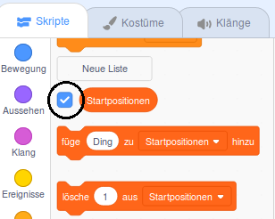

## Aufgabe: Nach links drehen

Jetzt fügen Sie einige Punkte hinzu, die der Spieler sammeln muss.

\--- task \--- Erstellen Sie ein neues Sprite mit dem Namen 'red'. Dieses Sprite sollte ein kleiner roter Punkt sein.


\--- /task \---

\--- task \--- Fügen Sie dieses Skript zu Ihrem 'roten' Sprite hinzu, um alle paar Sekunden einen neuen Klon des Sprites zu erstellen:


```blocks3
    Wenn die Flagge angeklickt wird
    ausblenden
    warten (2) Sekunden
    für immer
        Erstellen Sie einen Klon von (ich selbst)
        warten Sie (wählen Sie zufällig (5) bis (10))
    Sekunden
```

\--- /task \---

Wenn Sie jetzt auf die grüne Flagge klicken, scheint nichts zu passieren. Dies liegt daran, dass alle geklonten Sprites versteckt sind und an derselben Stelle angezeigt werden.

Sie werden Code hinzufügen, damit jeder neue Klon in einer der vier Ecken der Bühne angezeigt wird.


Aufgabe Erstellen Sie eine neue Liste mit der Bezeichnung `Startpositionen`{: class = "block3variables"}. Klicken Sie auf das Symbol `(+)` der Liste, um die Werte `-180`{: class = "block3variables" hinzuzufügen } und `180`{: class = "block3variables"}.


[[[generic-scratch3-make-list]]]

Dann können Sie die Liste ausblenden, indem Sie das Kontrollkästchen deaktivieren:

 \--- /task \---

Beachten Sie, dass die Koordinate für jede Ecke der Bühne eine Kombination aus `180` und `-180`. Dies bedeutet, dass Sie die Liste verwenden können, um eine Ecke der Bühne zufällig auszuwählen.

\--- task \--- Fügen Sie diesen Code zum 'dot' Sprite hinzu, damit jeder neue Sprite-Klon in einer zufälligen Ecke erscheint und sich dann langsam in Richtung des Controller-Sprites bewegt.


```blocks3
    Wenn ich als Klon
    beginne, gehe zu x: (Punkt (wähle zufällig (1) bis (2)) von [Startpositionen v]) y: (Punkt (wähle Zufall (1) bis (2)) von [Startpositionen v])
    Punkt in Richtung (Controller v)

    Wiederholen, bis <touching (controller v)?>
        Schritte (1) Schritte
    enden
```

\--- / task \--- Dieser neue Code wählt entweder `-180` oder `180` für die x- und y-Position, was bedeutet, dass jeder Punkt-Sprite-Klon in einer Ecke der Bühne beginnt.

\--- Aufgabe \--- Testen Sie Ihr Projekt. Sie sollten rote Punkte in den Ecken der Bühne sehen und sich langsam in Richtung Controller bewegen.

 \--- /task \---

Aufgabe Erstellen Sie zwei neue Variablen mit dem Namen `Leben`{: class = "block3variables"} und `Punkte`{: class = "block3variables"}.

 \--- /task \---

Aufgabe Füge der Bühne `Code hinzu, um die Variable <code> lives`{: class = "block3variables"} auf `3` und die `Punkte`{: class = "block3variables"} auf `0` um der Start des Spiels. 

```blocks3
Wenn das Flag auf
geklickt wurde, setzen Sie [Leben v] auf (3).
Setzen Sie [Punkte v] auf (0).
```

\--- /task \---

\--- task \--- Füge diesen Code am Ende des Stage-Skripts hinzu, damit das Spiel endet, wenn der Spieler das letzte Leben verliert:


```blocks3
    warte bis <(lebt :: Variablen) < [1]>
    stop [all v]
```

\--- /task \---

Der Spieler sollte Punkte für das Fangen von Punkten gewinnen und sollte das Leben verlieren, weil er keine Punkte fangen konnte. Ein Punkt kann nur erfasst werden, indem die Farbe des Controllers an die Farbe des Punkts angepasst wird.

\--- task \--- Kehren Sie zum Scripts-Bereich des 'roten' Punkt-Sprites zurück, um einige Codeblöcke am Ende von Sprites `hinzuzufügen, wenn ich als Klon`{: class = "block3control"} -Start beginne.

Zuerst müssen Sie den Punktklon `in 5 Schritten`{: class = "block3motion"} bewegen, sodass er den Controller überlappt.

Fügen Sie dann Code hinzu, um entweder `1` bis `zu addieren. Punktzahl`{: class = "block3variables"}, wenn die Farbe des Punktklons bei Berührung mit der Farbe des Controllers übereinstimmt, oder nehmen Sie `1` von `Leben.`{ : class = "block3variables"}, wenn ihre Farben nicht übereinstimmen.

[[[generic-scratch3-sound-from-library]]]


```blocks3
    Schritt (5) die Schritte
    wenn <touching color [#FF0000]?> dann
        Änderung [score v] durch (1)
        Play Sound (pop v) bis getan
    sonst
        Änderung [lebt v] mit (-1)
        Spiel Ton (Laser1 v) bis getan
    Ende
    Diesen Klon löschen
```

\--- /task \---

\--- task \---

Test your game to make sure that:

1. You lose a life if you don’t match a dot with the correct colour
2. You score a point if you match a dot correctly

\--- /task \---