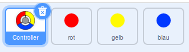
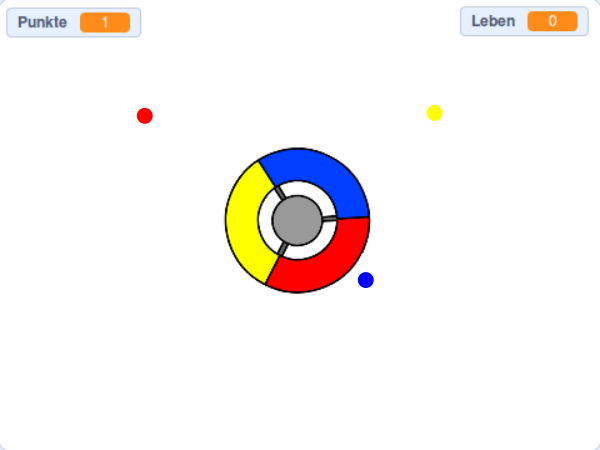

## Noch mehr Punkte

\--- task \---

Duplicate your 'red' dot sprite twice, and name the two new sprites 'yellow' and 'blue'.



\--- /task \---

\--- task \---

Change the costume of each new sprite so it is the correct colour: the 'yellow' sprite should be yellow, and the 'blue' sprite should be blue.

\--- /task \---

\--- task \---

Change the code of each sprite so that the player has to match dot clone to the correct colour on the controller to score points.



\--- hints \---

\--- hint \---

This is the code you need to find and alter for both new sprites:


```blocks3
    falls <wird Farbe [#FF0000] berührt?> , dann
    ändere [Punkte v] um (1)
    spiele Klang (Plopp v) ganz
    ...
    Ende
```

\--- /hint \---

\--- hint \---

This is how you need to change the code for the yellow sprite:

```blocks3
    falls <wird Farbe [#FFFF00] berührt?>, dann     ändere [Punkte v] um (1)
    spiele Klang (Plopp v) ganz
Ende
```

This is how you need to change the code for the blue sprite:

```blocks3
    falls <wird Farbe [#0000FF] berührt?>, dann     ändere [Punkte v] um (1)
    spiele Klang (Plopp v) ganz
Ende
```

\--- /hint \---

\--- /hints \---

\--- /task \---

If you play the game now, you can see that the dots sometimes get created on top of each other.

\--- task \---

Change the code for the 'yellow' dot sprite so that it waits four seconds after the flag is clicked before appearing.


```blocks3
    Wenn die Flagge angeklickt wird
    verstecke dich
+  warte (4) Sekunden
```


Then change the code for the 'blue' dot sprite so that it waits 6 seconds after the flag is clicked before appearing.

\--- /task \---