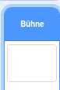
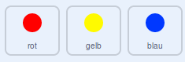

## Den Schwierigkeitsgrad steigern

Jetzt machen wir das Spiel schwieriger, je länger der Spieler es spielt. Das machst du, indem du die Punkte mit der Zeit schneller und schneller erscheinen lässt.

--- task --- Erstelle eine neue `Variable`{:class="block3variables"} mit dem Namen 'Verzögerung'.

 --- /task ---

--- task --- Wechsle zum Skript-Bereich der Bühne, und erstelle ein neues Skript, das die Variable `Verzögerung`{:class="block3variables"} auf `8` setzt und dann den Wert von `Verzögerung`{:class="block3variables"} langsam reduziert, während das Spiel läuft.


```blocks3
    Wenn die grüne Flagge angeklickt
setze [Verzögerung v] auf (8)
wiederhole bis < (Verzögerung) = (2)>
    warte (10) Sekunden
    ändere [Verzögerung v] um (-0.5)
Ende
```

--- /task ---

Beachte, dass dieser Code dem Code sehr ähnlich ist, den du zum Erstellen eines Countdown-Timers verwenden würdest!

Als nächstes verwendest Du die Variable `Verzögerung`{:class="block3variables"} in den Codeskripten der Figuren 'rot', 'gelb' und 'blau'.

--- task --- Entferne den Code-Block, der das Spiel eine zufällige Anzahl von Sekunden warten lässt bevor es einen neuen Punktklon erzeugt. Ersetze den Block, den du entfernt hast, durch deine neue Variable `Verzögerung`{:class="block3variables"}:



```blocks3
-   warte (Zufallszahl von (5) bis (10)) Sekunden
    warte (Verzögerung :: variables) Sekunden
```

Tu das für alle drei Punkt-Figuren.

--- /task ---

--- task --- Teste das Spiel und überprüfe, ob die Punkte im Laufe des Spiels schneller erscheinen.

+ Funktioniert das für die Punkte aller drei Farben?
+ Siehst du, dass der Wert der Variablen `Verzögerung`{:class="block3variables"} abnimmt? --- /task ---