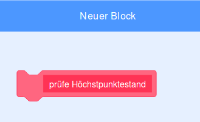

## Höchstpunktestand

Du wirst den Höchstpunktestand des Spiels speichern, damit die Spieler sehen können, wie gut sie sind.

\--- task \--- Erstelle eine neue Variable mit dem Namen `Höchstpunktestand`{:class="block3variables"}.


\--- /task \---

\--- task \--- Wähle die Bühne aus. Klicke auf ‚Meine Blöcke‘ und erstelle einen neuen benutzerdefinierten Block namens `prüfe Höchstpunktestand`{:class=„block3myblocks“}.

 

\--- /task \---

\--- task \--- Füge deinem benutzerdefinierten Block Code hinzu, damit der Block prüft, ob der aktuelle Wert von `Punkte`{:class="block3variables"} größer als der Wert von `Höchstpunktestand`{:class="block3variables"} ist und speichere dann den Wert von `Punkte`{:class="block3variables"} als neuen Wert von `Höchstpunktestand`{:class="block3variables"}.


```blocks3
    Definiere prüfe Höchstpunktestand
wenn <(Punkte :: variables) > (Höchstpunktestand)>, dann
    setze [Höchstpunktestand v] auf (Punkte :: variables)
Ende
```

\--- /task \---

\--- task \--- Füge deinen neuen benutzerdefinierten Block zum Bühnen-Skript vor dem Ende des Skripts hinzu.


```blocks3
Wenn die Flagge angeklickt wird
setze [Leben v] auf (3)
setze [Punkte v] auf (0)
warte bis <(Leben) < (1)>

+ prüfe Höchstpunktestand : : custom
stoppe [alles v]
```

\--- /task \---

\--- task \---

Spiele dein Spiel zweimal, um zu prüfen, ob deine Punktzahl als `Höchstpunktestand`{:class="block3variables"} richtig gespeichert wird.

\--- /task \---