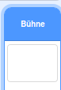

## Hohe Punktzahl

Sie speichern den Highscore des Spiels, damit die Spieler sehen können, wie gut sie sind.

\--- task \--- Erstellen Sie eine neue Variable mit dem Namen `High Score`{: class = "block3variables"}.



\--- /task \---

\--- Aufgabe \--- Wählen Sie die Bühne aus. Klicken Sie auf ‚Meine Blöcke‘ und erstellen Sie einen neuen benutzerdefinierten Block genannt `Check hohe Punktzahl`{: class = „block3myblocks“}.

 

\--- /task \---

\--- task \--- Fügen Sie Ihrem benutzerdefinierten Block Code hinzu, damit der Block prüft, ob der aktuelle Wert von `Score`{: class = "block3variables"} größer als der Wert von `High Score`{: class = ist "block3variables"} Variable und speichert dann den Wert von `Score`{: class = "block3variables"} als neuen Wert von `High Score`{: class = "block3variables"}.


```blocks3
    definiere check high score
    wenn <(score :: variables) > (high score)> dann
        setze [high score v] auf (score :: variables)
    end
```

\--- /task \---

\--- task \--- Fügen Sie vor dem Ende des Skripts Ihren neuen benutzerdefinierten Block zum Stage-Skript hinzu.


```blocks3
wenn Flag geklickt
Sets [lebt v] bis (3)
Satz [score v] auf (0)
Warten bis <(Leben) < (1)>

+ prüft hohe Punktzahl :: Gewohnheit
Stopp [all v]
```

\--- /task \---

\--- task \---

Spiele dein Spiel zweimal, um zu prüfen, ob deine Punktzahl als `Punktestand`{: class = "block3variables"} richtig gespeichert wird.

\--- /task \---