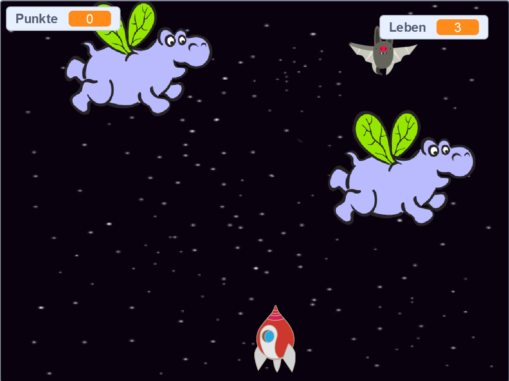

## Wie geht es weiter?

Versuche das Projekt [Krieg der Klone](https://projects.raspberrypi.org/de-DE/projects/clone-wars?utm_source=pathway&utm_medium=whatnext&utm_campaign=projects) in dem du ein Spiel machst wo du die Erde vor Monstern aus dem Weltall retten musst. In diesem Projekt kannst du das, was du über das Klonen von Figuren und das Hinzufügen von Punkten gelernt hast, verwenden!

--- no-print ---

Klicke zum Starten auf die grüne Flagge im Beispiel unten und drücke <kbd>Pfeil links</kbd> und <kbd>Pfeil rechts</kbd> um das Raumschiff zu steuern. Drücke die <kbd>Leertaste</kbd> um zu schießen.

  <iframe allowtransparency="true" width="485" height="402" src="https://scratch.mit.edu/projects/embed/276887163/?autostart=false" frameborder="0" scrolling="no"></iframe>
  

--- /no-print ---

Sammle durch, das Abschießen von fliegenden Weltraum-Flußpferden, so viele Punkte wie du kannst. Wenn du mit einem Flußpferd zusammenstößt, oder von einer Orange, die von den Fledermäusen fallen gelassen werden, getroffen wirst, verlierst du ein Leben.

--- print-only ---

--- /print-only ---

***

Dieses Projekt wurde von freiwilligen Helfern übersetzt:

Karl Schuh

Tassilo Scherrer

Dank freiwilliger Helfer können wir Menschen auf der ganzen Welt die Möglichkeit geben, in ihrer eigenen Sprache zu lernen. Du kannst uns helfen, mehr Menschen zu erreichen, indem Du dich freiwillig zum Übersetzen meldest - weitere Informationen unter [rpf.io/translate](https://rpf.io/translate).