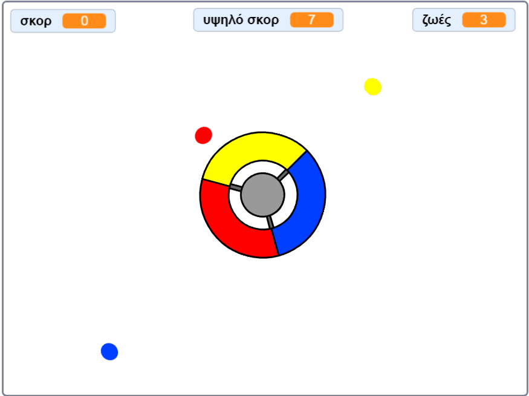

\--- no-print \---

Αυτή είναι η έκδοση **Scratch 3** του έργου. Υπάρχει επίσης η [έκδοση Scratch 2 του έργου](https://projects.raspberrypi.org/en/projects/catch-the-dots-scratch2).

\--- /no-print \---

## Εισαγωγή

Σε αυτό το έργο θα μάθεις πώς να δημιουργήσεις ένα παιχνίδι στο οποίο ο παίκτης πρέπει να ταιριάξει χρωματιστές τελείες με το αντίστοιχο χρώμα του χειριστηρίου.

\--- no-print \---

Χρησιμοποίησε τα βελάκια του πληκτρολογίου για να περιστρέψεις το χειριστήριο και να πιάσεις τις ιπτάμενες τελείες καθώς πλησιάζουν το κέντρο. Αν χάσεις τρεις τελείες, το παιχνίδι τελειώνει.

  <iframe allowtransparency="true" width="485" height="402" src="https://scratch.mit.edu/projects/embed/252923761/?autostart=false" frameborder="0" scrolling="no"></iframe>
  

\--- /no-print \---

\--- print-only \---

\--- /print-only \---

## \--- collapse \---

## title: Τι θα μάθεις

+ Πώς να επιλέγεις τυχαία αντικείμενα από μία λίστα
+ Πώς να χρησιμοποιείς μεταβλητές για να καταγράφεις την ταχύτητα, τις ζωές και τη βαθμολογία του παίκτη

\--- /collapse \---

## \--- collapse \---

## title: Τι θα χρειαστείς

### Υλικό

+ Ένας υπολογιστής ικανός να τρέχει το Scratch 3

### Λογισμικό

+ Scratch 3 (either [online](https://rpf.io/scratchon){:target="_blank"} or [offline](https://rpf.io/scratchoff){:target="_blank"})

### Λήψεις

+ [Offline Scratch 2 project](https://rpf.io/p/en/catch-the-dots-go){:target="_blank"}

\--- /collapse \---

## \--- collapse \---

## title: Πρόσθετες σημειώσεις για εκπαιδευτικούς

\--- no-print \---

Αν χρειαστεί να εκτυπώσεις αυτό το έργο, παρακαλούμε να χρησιμοποιήσεις την [εκτυπώσιμη](https://projects.raspberrypi.org/en/projects/catch-the-dots/print) έκδοση.

\--- /no-print \---

You can find [the completed project here](https://rpf.io/p/en/catch-the-dots-get){:target="_blank"}.

\--- /collapse \---