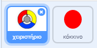
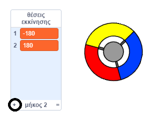
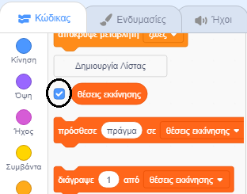

## Κέρδισε πόντους ή χάσε ζωές

Τώρα θα προσθέσεις μερικές τελείες τις οποίες πρέπει να συλλέγει ο παίκτης.

\--- task \--- Δημιούργησε ένα νέο αντικείμενο με όνομα 'κόκκινο'. Αυτό το αντικείμενο πρέπει να είναι μια μικρή κόκκινη τελεία.



\--- /task \---

\--- task \--- Πρόσθεσε αυτόν τον κώδικα στο 'κόκκινο' αντικείμενο για να δημιουργείς ένα νέο κλώνο του αντικειμένου κάθε μερικά δευτερόλεπτα:


```blocks3
    όταν γίνει κλικ στη σημαία
    εξαφανίσου
    περίμενε (2) δευτερόλεπτα
    για πάντα
        δημιούργησε κλώνο του (εαυτού μου v)
        περίμενε (επίλεξε τυχαίο (5) εώς (10)) δευτερόλεπτα
    τέλος
```

\--- /task \---

Αν κάνεις κλικ στην πράσινη σημαία τώρα, δε φαίνεται να συμβαίνει κάτι. Αυτό εξηγείται επειδή όλα τα κλωνοποιημένα αντικείμενα είναι εξαφανισμένα και εμφανίζονται στο ίδιο σημείο.

Θα προσθέσεις κώδικα ώστε κάθε κλώνος να παρουσιάζεται σε μία από τις τέσσερις γωνίες του Σκηνικού.


\--- task \--- Δημιούργησε μία νέα λίστα με όνομα `θέσεις εκκίνησης`{:class="block3variables"}, πάτησε το εικονίδιο `(+)` της λίστας για να προσθέσεις τις τιμές `-180`{:class="block3variables"} και `180`{:class="block3variables"}.




[[[generic-scratch3-make-list]]]

Στη συνέχεια μπορείς να εξαφανίσεις τη λίστα αποεπιλεγόντας αυτό το κουτί:

 \--- /task \---

Θυμήσου ότι οι συντεταγμένες κάθε γωνίας του Σκηνικού είναι συνδυασμός των `180` και `-180`. Αυτό σημαίνει ότι μπορείς να χρησιμοποιείς τη λίστα για να επιλέγεις τυχαία μια γωνία του Σκηνικού.

\--- task \--- Πρόσθεσε αυτόν τον κώδικα στο 'κόκκινο' αντικείμενο για να εμφανίζεις κάθε νέο κλώνο του αντικειμένου σε μια τυχαία γωνία που στη συνέχεια θα κινείται αργά προς το χειριστήριο.


```blocks3
    όταν ξεκινήσω ως κλώνος
    πήγαινε σε θέση x: (στοιχείο (επίλεξε τυχαίο (1) εώς (2)) λίστας [θέσεις εκκίνησης v]) y: (στοιχείο (επίλεξε τυχαίο (1) εώς (2)) λίστας [θέσεις εκκίνησης v])
    δείξε προς (χειριστήριο v)
    εμφανίσου
    επανάλαβε ώσπου <touching (controller v)?>
        κινήσου (1) βήματα
    τέλος
```

\--- /task \--- Αυτός ο νέος κώδικας επιλέγει `-180` ή `180` για τις συντεταγμένες x και y, που σημαίνει ότι κάθε κλώνος της 'τελείας' ξεκινά από μία γωνία του Σκηνικού.

\--- task \--- Δοκίμασε τον κώδικα. Θα πρέπει να δεις κόκκινες τελείες να εμφανίζονται στις γωνίες του Σκηνικού και να κινούνται αργά προς το χειριστήριο.

 \--- /task \---

\--- task \--- Δημιούργησε δύο νέες μεταβλητές με ονόματα `ζωές`{:class="block3variables"} και `σκορ`{:class="block3variables"}.

 \--- /task \---

\--- task \--- Πρόσθεσε κώδικα στο Σκηνικό για να ορίσεις την αρχική τιμή της μεταβλητής `ζωές`{:class="block3variables"} σε `3` και της μεταβλητής `σκορ`{:class="block3variables"} σε `0` στην έναρξη του παιχνιδιού. 

```blocks3
όταν γίνει κλικ στη σημαία
όρισε [ζωές v] σε (3)
όρισε [σκορ v] σε (0)
```

\--- /task \---

\--- task \--- Πρόσθεσε αυτό το τμήμα κώδικα στο τέλος του κώδικα για το Σκηνικό ώστε το παιχνίδι να τελειώνει όταν ο παίκτης χάσει και την τελευταία ζωή του:


```blocks3
    επανάλαβε ώσπου <(ζωές :: μεταβλητές) < [1]>
    σταμάτησε [όλα v]
```

\--- /task \---

Ο παίκτης θα κερδίζει πόντους όταν πιάνει τελείες και θα χάνει ζωές όταν αποτυγχάνει να πιάσει τελείες. Μία τελεία μπορεί να πιαστεί ταιριάζοντας το χρώμα του χειριστηρίου με το χρώμα της.

\--- task \--- Πήγαινε στον κώδικα του 'κόκκινου' αντικειμένου για να προσθέσεις μερικά μπλοκ στο τέλος του τμήματος κώδικα `όταν ξεκινήσω ως κλώνος`{:class="block3control"}.

Πρώτα, κάνε τον κλώνο της τελείας να `κινείται 5 βήματα`{:class="block3motion"} ώστε να πέφτει πάνω στο χειριστήριο.

Στη συνέχεια πρόσθεσε κώδικα ώστε είτε να αυξάνεις κατά `1` το `σκορ`{:class="block3variables"} αν το χρώμα του κλώνου ταιριάζει με το χρώμα του χειριστηρίου όταν ακουμπήσουν, ή να μειώνεις κατά `1` τις `ζωές`{:class="block3variables"} αν τα χρώματα δεν ταιριάζουν.

[[[generic-scratch3-sound-from-library]]]


```blocks3
    κινήσου (5) βήματα
    εάν <touching color [#FF0000]?> τότε
        άλλαξε [σκορ v] κατά (1)
        παίξε ήχο (ποπ v) μέχρι τέλους
    αλλιώς
        άλλαξε [ζωές v] κατά (-1)
        παίξε ήχο (Laser1 v) μέχρι τέλους
    τέλος
    διάγραψε αυτόν τον κλώνο
```

\--- /task \---

\--- task --

Test your game to make sure that:

1. You lose a life if you don’t match a dot with the correct colour
2. You score a point if you match a dot correctly

\--- /task \---