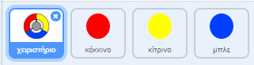
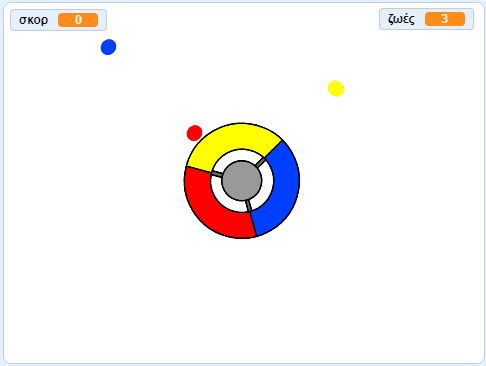

## Περισσότερες τελείες

\--- task \---

Διπλασίασε δύο φορές την 'κόκκινη' τελεία και ονόμασε τα δύο νέα αντικείμενα 'κίτρινο' και 'μπλε'.



\--- /task \---

\--- task \---

Άλλαξε την ενδυμασία κάθε νέου αντικειμένου ώστε το 'κίτρινο' αντικείμενο να γίνει κίτρινο και το 'μπλε' αντικείμενο να γίνει μπλε.

\--- /task \---

\--- task \---

Άλλαξε τον κώδικα κάθε νέου αντικειμένου ώστε ο παίκτης να πρέπει να ταιριάξει κάθε κλώνο με το σωστό χρώμα του χειριστηρίου για να κερδίσει πόντους.



\--- hints \---

\--- hint \---

Αυτός είναι ο κώδικας που πρέπει να βρεις και τροποποιήσεις και για τα δύο νέα αντικείμενα:


```blocks3
    εάν <touching color [#FF0000]?> τότε 
  άλλαξε [score v] κατά (1)
  παίξε τον ήχο (pop v)
  ...
    τέλος
```

\--- /hint \---

\--- hint \---

Έτσι πρέπει να τροποποιήσεις τον κώδικα για το κίτρινο αντικείμενο:

```blocks3
    εάν <touching color [#FFFF00]? :: +> τότε
        άλλαξε [score v] κατά (1)
παίξε τον ήχο (pop v)
end
```

Έτσι πρέπει να τροποποιήσεις τον κώδικα για το μπλε αντικείμενο:

```blocks3
    εάν <touching color [#0000FF]? :: +> τότε
        άλλαξε [score v] κατά (1)
        παίξε ήχο (pop v)
    end
```

\--- /hint \---

\--- /hints \---

\--- /task \---

If you play the game now, you can see that the dots sometimes get created on top of each other.

\--- task \---

Άλλαξε τον κώδικα στο 'κίτρινο' αντικείμενο ώστε να περιμένει τέσσερα δευτερόλεπτα αφού έγινε κλικ στη σημαία για να εμφανιστεί.


```blocks3
    όταν γίνει κλικ στη σημαία
    εξαφανίσου
+   περίμενε (4) δευτερόλεπτα
```


Έπειτα άλλαξε τον κώδικα για το 'μπλε' αντικείμενο ώστε να περιμένει έξι δευτερόλεπτα αφού έγινε κλικ στη σημαία για να εμφανιστεί.

\--- /task \---