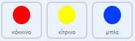

## Αύξησε τη δυσκολία

Τώρα πρόκειται να κάνεις το παιχνίδι δυσκολότερο για τον παίκτη, όσο αυτός δε χάνει και συνεχίζει να παίζει. Αυτό θα γίνει κάνοντας τις τελείες να εμφανίζονται όλο και πιο γρήγορα όσο περνάει ο χρόνος.

\--- task \--- Δημιούργησε μία νέα `μεταβλητή`{:class="block3variables"} με όνομα 'καθυστέρηση'.

 \--- /task \---

\--- task \--- Πήγαινε στον κώδικα του Σκηνικού και γράψε κώδικα που ορίζει την `καθυστέρηση`{:class="block3variables"} σε `8` και έπειτα μειώνει την τιμή της `καθυστέρησης`{:class="block3variables"} όσο διαρκεί το παιχνίδι.


```blocks3
    όταν γίνει κλικ στη σημαία
    όρισε [καθυστέρηση v] σε (8)
    επανάλαβε ώσπου < (καθυστέρηση) = (2)>
        περίμενε (10) δευτερόλεπτα
        άλλαξε [καθυστέρηση v] κατά (-0.5)
    τέλος
```

\--- /task \---

Παρατήρησε ότι αυτός ο κώδικας είναι σχεδόν όμοιος με τον κώδικα που θα χρησιμοποιήσεις για να δημιουργήσεις ένα χρονόμετρο αντίστροφης μέτρησης!

Στη συνέχεια, χρησιμοποίησε τη μεταβλητή `καθυστέρηση`{:class="block3variables"} στον κώδικα των αντικειμένων 'κόκκινο', 'κίτρινο' και 'μπλε'.

\--- task \--- Αφαίρεσε τα μπλοκ κώδικα που κάνουν το παιχνίδι να περιμένει ένα τυχαίο αριθμό δευτερολέπτων κατά τη δημιουργία των κλώνων των τελειών. Αντικατέστησε τα μπλοκ που αφαίρεσες με τη νέα μεταβλητή `καθυστέρηση`{:class="block3variables"}:



```blocks3
<br />-   περίμενε (επίλεξε τυχαίο (5) εώς (10)) δευτερόλεπτα
    περίμενε (καθυστέρηση :: variables) δευτερόλεπτα
```

Κάνε το ίδιο και για τα τρία αντικείμενα τελείας.

\--- /task \---

\--- task \--- Δοκίμασε τις αλλαγές και έλεγξε αν οι τελείες εμφανίζονται όλο και πιο γρήγορα καθώς εξελίσσεται το παιχνίδι.

+ Λειτουργεί και για τις τρεις χρωματιστές τελείες;
+ Μπορείς να δεις ότι η τιμή της μεταβλητής `καθυστέρηση`{:class="block3variables"} μειώνεται; \--- /task \---