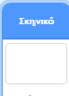

## Υψηλό Σκορ

Πρόκειται να αποθηκεύεις το υψηλότερο σκορ έτσι ώστε οι παίκτες να μπορούν να δουν πόσο καλά τα καταφέρνουν.

\--- task \--- Δημιούργησε μία νέα μεταβλητή με όνομα `υψηλό σκορ`{:class="block3variables"}.



\--- /task \---

\--- task \--- Επέλεξε το Σκηνικό. Κάνε κλικ στο 'Οι εντολές μου' και δημιούργησε ένα νέο μπλοκ με όνομα `έλεγξε υψηλό σκορ`{:class="block3myblocks"}.

 

\--- /task \---

\--- task \--- Πρόσθεσε κώδικα στο δικό σου μπλοκ ώστε να ελέγχει αν η τρέχουσα τιμή της μεταβλητής `σκορ`{:class="block3variables"} είναι μεγαλύτερη από την τιμή της μεταβλητής `υψηλό σκορ`{:class="block3variables"} και στη συνέχεια να αποθηκεύει την τιμή του `σκορ`{:class="block3variables"} ως τη νέα τιμή του `υψηλό σκορ`{:class="block3variables"}.


```blocks3
    ορισμός έλεγξε υψηλό σκορ
    εάν <(σκορ :: variables) > (υψηλό σκορ)> τότε
        όρισε [υψηλό σκορ v] σε (σκορ :: variables)
    τέλος
```

\--- /task \---

\--- task \--- Πρόσθεσε το νέο σου μπλοκ στον κώδικα του Σκηνικού πριν το τέλος του.


```blocks3
όταν γίνει κλικ στη σημαία
όρισε [ζωές v] σε (3)
όρισε [σκορ v] σε (0)
περίμενε ώσπου <(ζωές) < (1)>

+ έλεγξε υψηλό σκορ :: custom
σταμάτησε [όλα v]
```

\--- /task \---

\--- task --

Παίξε το παιχνίδι σου δύο φορές για να ελέγξεις ότι το σκορ αποθηκεύεται σωστά ως `υψηλό σκορ`{:class="block3variables"}.

\--- /task \---