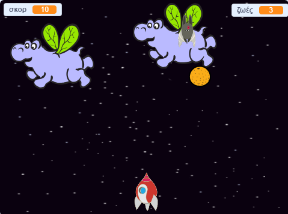

## Τι υπάρχει στη συνέχεια;

Δοκίμασε το έργο [Ο πόλεμος των κλώνων](https://projects.raspberrypi.org/el-GR/projects/clone-wars?utm_source=pathway&utm_medium=whatnext&utm_campaign=projects) προκειμένου να φτιάξεις ένα παιχνίδι στο οποίο θα πρέπει να σώσεις τη Γη από διαστημικά τέρατα. Σε αυτό το έργο, θα μπορέσεις να χρησιμοποιήσεις ότι έχεις μάθει σχετικά με την δημιουργία κλώνων των αντικειμένων και με την προσθήκη ενός σκορ!

--- no-print ---

Κάνε κλικ στην πράσινη σημαία στο παρακάτω παράδειγμα για να ξεκινήσεις και κατόπιν πάτα τα πλήκτρα <kbd>αριστερό</kbd> και <kbd>δεξί</kbd> βέλος για να μετακινήσεις το διαστημόπλοιο και το πλήκτρο <kbd>κενό</kbd> για να πυροβολήσεις.

  <iframe allowtransparency="true" width="485" height="402" src="https://scratch.mit.edu/projects/embed/418352322/?autostart=false" frameborder="0" scrolling="no"></iframe>
  

--- /no-print ---

Πέτυχε όσους περισσότερους πόντους μπορείς πυροβολώντας ιπτάμενους διαστημικούς ιπποπόταμους. Αν χτυπηθείς από ιπποπόταμο ή από ένα πορτοκάλι που ρίχνουν οι νυχτερίδες, θα χάσεις μια ζωή.

--- print-only ---

--- /print-only ---

***
Το έργο αυτό μεταφράστηκε από τους εθελοντές:

Μάνος Ζεάκης

Γιώργος Δούκας

Διονύσιος Μπραιλας

Χάρη στους εθελοντές, μπορούμε να δώσουμε σε ανθρώπους σε όλο τον κόσμο την ευκαιρία να μάθουν στη γλώσσα τους. Μπορείτε να μας βοηθήσετε να προσεγγίσουμε περισσότερους ανθρώπους μεταφράζοντας εθελοντικά - περισσότερες πληροφορίες στο [rpf.io/translate](https://rpf.io/translate).