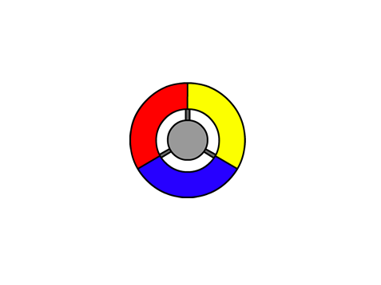

## Creating a controller

Let's start by creating a controller, that will be used to collect dots.

--- task ---
Open the 'Catch the Dots' starter project.

**Online:** Open Scratch starter project at [rpf.io/dots-on](http://rpf.io/dots-on). If you have a Scratch account, you can click on Remix in the top right-hand corner to save a copy of the project to your account.

**Offline:** Download the starter project from [rpf.io/dots-off](http://rpf.io/dots-off) and then open it using the offline editor.

--- /task ---

You should see a controller sprite:




--- task ---
Add some code to turn your controller to the right when the right arrow key is pressed:


```blocks
	when flag clicked
	forever
		if <key [right arrow v] pressed?> then
			turn right (3) degrees
		end
	end
```
--- /task ---

--- task ---
Test out your controller -- it should spin to the right when you press the right arrow key on the keyboard.
--- /task ---

--- task ---
Add some more code to turn your controller to the left when the left arrow key is pressed.


--- hints ---
--- hint ---
Find the code that checks whether the right arrow key is pressed and turns right. Can you add a copy of this code, but change it to check whether the left arrow key is pressed instead?
--- /hint ---
--- hint ---
Here are the blocks you will need:
```blocks
<key [space v] pressed?>

turn left(15) degrees

if <> then

end
```
--- /hint ---
--- hint ---
Here is the code you will need to add:
```blocks
	when flag clicked
	forever
		if <key [right arrow v] pressed?> then
			turn right (3) degrees
		end
        + if <key [left arrow v] pressed?> then
			+ turn left(3) degrees
		+ end
	end
```
--- /hint ---
--- /hints ---
--- /task ---
