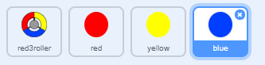

## More dots

--- task ---
Duplicate your 'red' dot sprite twice, and name the two new sprites 'yellow' and 'blue'.


--- /task ---

--- task ---
Change the costume of each sprite so it is the correct colour - the 'yellow' sprite should be yellow, and the 'blue' sprite should be blue.
--- /task ---

--- task ---
Edit code for each sprite so that each coloured dot has to match the correct colour on the controller.


--- hints ---
--- hint ---
This is the code you will need to find and alter in each sprite:
```blocks
	if <touching color [#FF0000]?> then
		change [score v] by (1)
		play sound [pop v]
        ...
	end
```
--- /hint ---
--- hint ---
Here is the code for the yellow sprite
```blocks
	if <touching color [#FFFF00]?> then
        ...
	end
```

Here is the code for the blue sprite
```blocks
	if <touching color [#0000FF]?> then
        ...
	end
```
--- /hint ---
--- /hints ---
--- /task ---

You will find that if you play the game now, the dots will sometimes get created one on top of another.

--- task ---
Change the yellow dot to wait 4 seconds after the flag is clicked before appearing, and change the blue dot to wait 6 seconds.

```blocks
	when flag clicked
	hide
	+ wait (4) secs
    ...
```
--- /task ---
