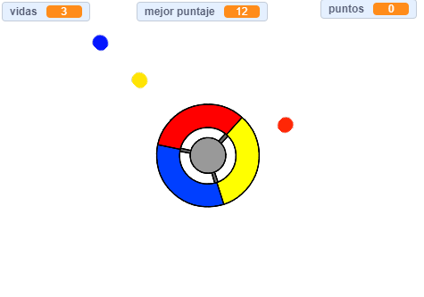

\--- no-print \---

Esta es una versión del proyecto en **Scratch 3**. También hay una [versión del proyecto en Scratch 2](https://projects.raspberrypi.org/en/projects/catch-the-dots-scratch2).

\--- /no-print \---

## Introducción

En este proyecto, aprenderás cómo crear un juego en el que el jugador tenga que hacer coincidir puntos de colores con el color correcto de la rueda del controlador.

\--- no-print \---

Use the arrow keys on your keyboard to rotate the controller wheel and catch the flying dots as they reach the centre. Si fallas en atrapar tres puntos, el juego termina.

  <iframe allowtransparency="true" width="485" height="402" src="https://scratch.mit.edu/projects/embed/252923761/?autostart=false" frameborder="0" scrolling="no"></iframe>
  

\--- /no-print \---

\--- print-only \---

\--- /print-only \---

## \--- collapse \---

## title: What you will learn

+ How to choose random items from a list
+ How to use variables to track speed, lives, and the player's score

\--- /collapse \---

## \--- collapse \---

## title: What you will need

### Hardware

+ A computer capable of running Scratch 3

### Software

+ Scratch 3 (either [online](http://rpf.io/scratchon){:target="_blank"} or [offline](http://rpf.io/scratchoff){:target="_blank"})

### Downloads

+ [Offline Scratch 2 project](http://rpf.io/p/en/catch-the-dots-go){:target="_blank"}

\--- /collapse \---

## \--- collapse \---

## title: Additional notes for educators

\--- no-print \---

If you need to print this project, please use the [printer-friendly version](https://projects.raspberrypi.org/en/projects/catch-the-dots/print).

\--- /no-print \---

You can find [the completed project here](http://rpf.io/p/en/catch-the-dots-get){:target="_blank"}.

You can find the [completed project here](https://scratch.mit.edu/projects/252923761/#editor){:target="_blank"}

\--- /collapse \---