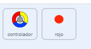
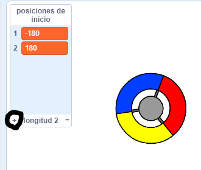
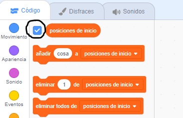
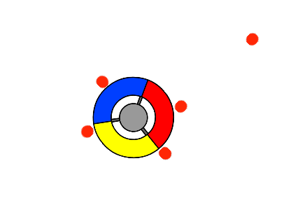

## Gana puntos o pierde vidas

Ahora vas a agregar algunos puntos que el jugador necesita recoger.

--- task ---

Crea un nuevo objeto llamado 'rojo'. Este objeto debe ser un pequeño punto rojo.



--- /task ---

--- task ---

Agrega este código a tu objeto 'rojo' para crear un nuevo clon del objeto cada algunos segundos:


```blocks3
  when flag clicked
	hide
	wait (2) seconds
	forever
		create clone of (myself v)
		wait (pick random (5) to (10)) secs
	end
```

--- /task ---

Si ahora haces clic en la bandera verde, parece que nada está sucediendo. Esto se debe a que todos los objetos clonados están ocultos y aparecen en el mismo lugar.

Vas a agregar código para hacer que cada nuevo clon aparezca en una de las cuatro esquinas del escenario.


--- task ---

Crea una nueva lista llamada `posiciones de inicio`{:class="block3variables"}, haz clic en el icono `(+)` de la lista para añadir los valores `-180`{:class="block3variables"} y `180`{:class="block3variables"}.




[[[generic-scratch3-make-list]]]

Luego puedes ocultar la lista desmarcando este cuadro:



--- /task ---

Observa que la coordenada para cada esquina del escenario es una combinación de `180` y `-180`. Esto significa que puedes usar la lista para elegir una esquina del escenario al azar.

--- task ---

Agrega este código al objeto 'punto' para hacer que cada nuevo clon aparezca en una esquina aleatoria y luego se mueva lentamente hacia el objeto controlador.


```blocks3
  when I start as a clone
	go to x: (item (pick random (1) to (2)) of [posiciónes de inicio v]) y: (item (pick random (1) to (2)) of [posiciónes de inicio v])
	point towards (controlador v)
	show
	repeat until <touching (controlador v)?>
		move (1) steps
	end

```

--- /task ---

Este nuevo código elige `-180` o `180` para las posiciones x e y, significa que cada clon del objeto 'punto' comienza en una esquina del escenario.

--- task ---

Prueba tu proyecto. Deberías ver puntos rojos que aparecen en las esquinas del escenario y se mueven lentamente hacia el controlador.



--- /task ---

--- task ---

Crea dos nuevas variables llamadas `vidas`{:class="block3variables"} y `puntos`{:class="block3variables"}.


--- /task ---

--- task ---

Añade código a tu etapa para establecer la variable `vidas`{:class="block3variables"} a `3` y la `puntos`{:class="block3variables"} a `0` al comienzo del juego. 


```blocks3
when flag clicked
set [vidas v] to (3)
set [puntos v] to (0)
```

--- /task ---

--- task ---

Agrega este código al final de la secuencia de comandos del escenario para que el juego termine cuando el jugador pierde la última vida:


```blocks3
    wait until <(vidas :: variables) < [1]>
	  stop [all v]
```

--- /task ---

El jugador debe ganar puntos por atrapar puntos, y perder vidas por no haber conseguido puntos. Un punto solo puede capturarse haciendo coincidir el color del controlador con el color del punto.

--- task ---

Vuelve a la zona de código del objeto 'rojo' para agregar algunos bloques al final del conjunto de bloques que comienza con: `cuando comienzo como un clon`{:class="block3control"}.

Primero, haz que el clon rojo se `mueva 5 pasos`{:class="block3motion"} para que se superponga al controlador.

Luego agrega el código para sumar `1` a `puntos`{:class="block3variables"} si el color del clon coincide con el color del controlador cuando se tocan, o para restar `1` a `vidas`{:class="block3variables"} si sus colores no coinciden.

[[[generic-scratch3-sound-from-library]]]


```blocks3
  move (5) steps
	if <touching color [#FF0000]?> then
		change [puntos v] by (1)
		play sound (pop v) until done
	else
		change [vidas v] by (-1)
		play sound (Laser1 v) until done
	end
	delete this clone
```

--- /task ---

--- task ---

Prueba tu juego para asegurarte de que:

1. Pierdes una vida si no haces coincidir un punto con el color correcto
2. Aumentas tus puntos en 1 si lo haces coincidir

--- /task ---