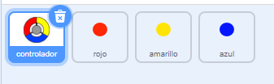
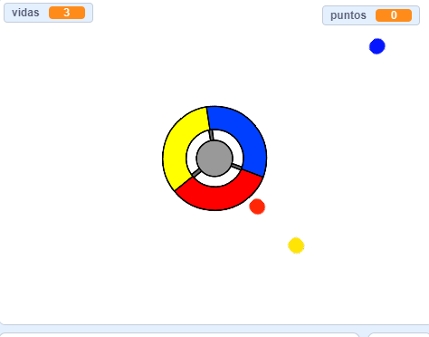

## Más puntos

--- task ---

Duplica el objeto 'rojo' dos veces y nombra a los dos nuevos objetos 'amarillo' y 'azul'.



--- /task ---

--- task ---

Cambia el disfraz de cada nuevo sprite para que tenga el color correcto: el sprite 'amarillo' debe ser amarillo, y el sprite 'azul' debe ser azul.

--- /task ---

--- task ---

Cambia el código de cada sprite para que el jugador tenga que hacer coincidir el clon de puntos con el color correcto en el controlador para obtener puntos.



--- hints ---


--- hint ---

Este es el código que necesitas encontrar y modificar para los nuevos objetos:


```blocks3
    if <touching color [#FF0000]?> then
		change [puntos v] by (1)
		play sound (pop v)
        ...
	end
```

--- /hint ---

--- hint ---

Así es como necesitas cambiar el código para el objeto amarillo:

```blocks3
    if <touching color [#FFFF00]? :: +> then
        change [puntos v] by (1)
        play sound (pop v)
	end
```

Así es como necesitas cambiar el código para el objeto azul:

```blocks3
    if <touching color [#0000FF]? :: +> then
        change [puntos v] by (1)
        play sound (pop v)
	end
```

--- /hint ---

--- /hints ---

--- /task ---

Si juegas ahora, puedes ver que los puntos a veces se crean uno encima del otro.

--- task ---

Cambia el código para el objeto 'amarillo' para que espere cuatro segundos después de hacer clic en la bandera antes de aparecer.


```blocks3
    when flag clicked
	hide
+	wait (4) seconds
```


Luego, cambia el código para el objeto 'azul' para que espere 6 segundos después de hacer clic en la bandera antes de aparecer.

--- /task ---