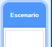
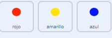

## Aumenta la dificultad

Ahora vas a hacer el juego más difícil cuanto más tiempo juegue el jugador. Harás esto haciendo que los puntos aparezcan más y más rápido con el tiempo.

\--- task \---

Crea una nueva `variable`{:class = "block3variables"} llamada 'retraso'.



\--- /task \---

\--- task \---

Ve al área de código del escenario y crea un nuevo script que de a la variable `retraso`{: class = "block3variables"} el valor `8` y luego reduzca lentamente el valor de `retraso`{:class = "block3variables"} mientras se ejecuta el juego.


```blocks3
    when flag clicked
    set [delay v] to (8)
    repeat until < (delay) = (2)>
        wait (10) seconds
        change [delay v] by (-0.5)
    end
```

\--- /task \---

¡Observa que este código es muy similar al código que usarías para crear un temporizador de cuenta regresiva!

A continuación, utiliza la variable `retraso`{:class = "block3variables"} en el código de los objetos 'rojo', 'amarillo' y 'azul'.

\--- task \---

Remove the code block that makes the game wait a random number of seconds between making the dot sprite clones. Replace the block you've removed with your new `delay`{:class="block3variables"} variable:



```blocks3
<br />-   wait (pick random (5) to (10)) secs
    wait (delay :: variables) secs
```

Do this for all three dot sprites.

\--- /task \---

\--- task \---

Test the game, and check whether the dots begin to appear more quickly as the game goes on.

+ Does this work for all three coloured dots?
+ Can you see that the value of the `delay`{:class="block3variables"} variable decreases?

\--- /task \---