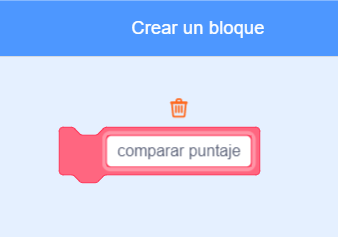

## Puntuación más alta

Vas a guardar la puntuación más alta del juego, para que los jugadores puedan ver qué tan bien juegan.

\--- task \---

Crea una nueva variable llamada `mejor puntaje`{:class = "block3variables"}.


\--- /task \---

\--- task \---

Selecciona el escenario. Haz clic en 'Mis bloques' y crea un nuevo bloque personalizado llamado `comparar puntaje`{:class = "block3myblocks"}.




\--- /task \---

\--- task \---

Agrega código a tu bloque personalizado para que el bloque verifique si el valor actual de `puntos`{:clase = "block3variables"} es mayor que el valor de `mejor puntaje`{: clase = variable "block3variables"}, y luego almacena el valor de `puntos`{:class = "block3variables"} como el nuevo valor de `mejor puntaje`{:class = "block3variables"}.


```blocks3
    definir comprobar puntuación alta
    si <(puntuación :: variables) > (puntuación alta)> luego
        fijar [puntuación alta v] a (puntuación :: variables)
    final
```

\--- /task \---

\--- task \---

Agrega tu nuevo bloque personalizado a la secuencia de comandos del escenario antes del final de la secuencia de comandos.


```blocks3
al hacer clic en la bandera
fijar [vidas v] a (3)
fijar [puntuación v] a (0)
esperar hasta <(vidas) < (1)>

+ comprobar puntuación alta :: personalizar
detener [todos v]
```

\--- /task \---

\--- task \---

Juega tu juego dos veces para comprobar si tu puntuación se guarda correctamente como el r `puntaje mayo`{:class = "block3variables"}.

\--- /task \---