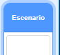

## Mejor puntaje

Vas a guardar la puntuación más alta del juego, para que los jugadores puedan ver qué tan bien juegan.

\--- task \---

Create a new variable called `high score`{:class="block3variables"}.



\--- /task \---

\--- task \---

Select the Stage. Click on 'My blocks' and create a new custom block called `check high score`{:class="block3myblocks"}.


\--- /task \---

\--- task \---

Add code to your custom block so that the block checks if the current value of `score`{:class="block3variables"} in larger than the value of the `high score`{:class="block3variables"} variable, and then stores the value of `score`{:class="block3variables"} as the new value of `high score`{:class="block3variables"}.


```blocks3
    definir comparar puntaje
  si < (puntos:: variables) > (mejor puntaje) > entonces 
    dar a [mejor puntaje v] el valor (puntos :: variables)
  fin
```

\--- /task \---

\--- task \---

Add your new custom block to the Stage script before the end of the script.


```blocks3
al presionar bandera verde
dar a [vidas v] el valor (3)
dar a [puntos v] el valor (0)
esperar hasta <(vidas) < (1)>

+ comparar puntaje :: custom
detener [todos v]
```

\--- /task \---

\--- task \---

Play your game twice to check whether your score gets correctly saved as the `high score`{:class="block3variables"}.

\--- /task \---