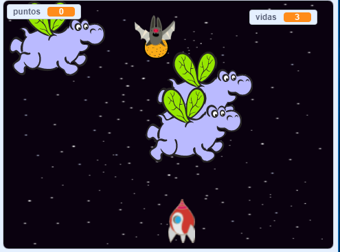

## Desafío: más colores

Pruebe el proyecto [Guerra de clones](https://projects.raspberrypi.org/en/projects/clone-wars?utm_source=pathway&utm_medium=whatnext&utm_campaign=projects) para hacer un juego en el cual tienes que salvar la Tierra de los monstruos del espacio. En ese proyecto, ¡podrás usar lo que has aprendido sobre clonar sprites y agregar una puntuación!

\--- no-print \---

Haz clic en la bandera verde en el siguiente juego de ejemplo para comenzar, y luego presiona las teclas de dirección <kbd>izquierda</kbd> y <kbd>derecha</kbd> para mover la nave espacial y la barra de <kbd>espacio</kbd> para disparar.

  <iframe allowtransparency="true" width="485" height="402" src="https://scratch.mit.edu/projects/embed/276887163/?autostart=false" frameborder="0" scrolling="no"></iframe>
  

\--- /no-print \---

Anota tantos puntos como puedas sin darle a los hipopótamos voladores del espacio. Si te golpea un hipopótamo o una naranja de las que tiran los murciélagos, pierdes una vida.

\--- print-only \---

\--- /print-only \---