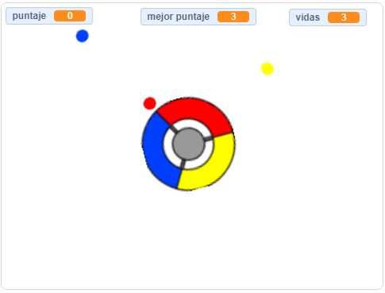

\--- no-print \---

Esta es la versión **Scratch 3** del proyecto. También hay una [versión Scratch 2 del proyecto](https://projects.raspberrypi.org/en/projects/catch-the-dots-scratch2).

\--- /no-print \---

## Introducción

En este proyecto aprenderás cómo crear un juego en el que el jugador tiene que hacer coincidir los puntos de colores con el color correspondiente en el mando.

\--- no-print \---

Usa las flechas en tu teclado para girar la rueda del mando y atrapar los puntos voladores antes de que lleguen al centro. Si fallas en atrapar tres puntos, el juego termina.

  <iframe allowtransparency="true" width="485" height="402" src="https://scratch.mit.edu/projects/embed/252923761/?autostart=false" frameborder="0" scrolling="no"></iframe>
  

\--- /no-print \---

\--- print-only \---

\--- /print-only \---

## \--- collapse \---

## title: Lo que aprenderás

+ How to choose random items from a list
+ Cómo usar variables para llevar cuenta de la velocidad, las vidas y la puntuación del jugador

\--- /collapse \---

## \--- collapse \---

## title: Lo que necesitarás

### Hardware

+ Una computadora capaz de ejecutar Scratch 3

### Software

+ Scratch 3 (either [online](https://rpf.io/scratchon){:target="_blank"} or [offline](https://rpf.io/scratchoff){:target="_blank"})

### Descargas

+ [Offline Scratch 2 project](https://rpf.io/p/en/catch-the-dots-go){:target="_blank"}

\--- /collapse \---

## \--- collapse \---

## title: Notas adicionales para educadores

\--- no-print \---

Si necesitas imprimir este proyecto, usa la [versión para imprimir](https://projects.raspberrypi.org/en/projects/catch-the-dots/print).

\--- /no-print \---

You can find [the completed project here](https://rpf.io/p/en/catch-the-dots-get){:target="_blank"}.

\--- /collapse \---