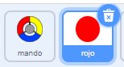
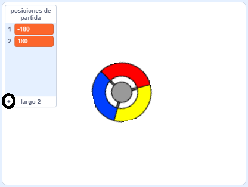
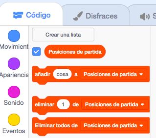
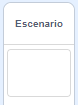

## Gana puntos o pierde vidas

Ahora vas a añadir algunos puntos que el jugador deberá recolectar.

--- task ---

Crea un nuevo objeto llamado «rojo». Este objeto debe ser un pequeño punto rojo.



--- /task ---

--- task ---

Agrega este código a tu objeto «rojo» para crear un nuevo clon del objeto cada algunos segundos:


```blocks3
    when flag clicked
    hide
    wait (2) seconds
    forever
        create clone of (myself v)
        wait (pick random (5) to (10)) secs
    end
```

--- /task ---

Si haces clic en la bandera verde ahora mismo, parecerá que nada sucede. Esto se debe a que todos los objetos clonados están ocultos y aparecen en el mismo lugar.

Vas a agregar código para hacer que cada vez que aparezca un nuevo clon sea en una de las cuatro esquinas del escenario.


--- task ---

Crea una nueva lista que se llame `posiciones de partida`{:class="block3variables"}, haz clic en el icono `(+)` de la lista para añadir los valores `-180`{:class="block3variables"} y `180`{:class="block3variables"}.




[[[generic-scratch3-make-list]]]

Luego puedes ocultar la lista desmarcando este cuadro:



--- /task ---

Observa que la coordenada para cada esquina del escenario es una combinación de `180` y `-180`. Esto significa que puedes usar la lista para elegir una esquina del escenario al azar.

--- task ---

Agrega este código al objeto «punto» para hacer que cada nuevo clon aparezca en una esquina aleatoria y luego se mueva despacio hacia el objeto mando.


```blocks3
    when I start as a clone
    go to x: (item (pick random (1) to (2)) of [posiciones de partida v]) y: (item (pick random (1) to (2)) of [posiciones de partida v])
    point towards (mando v)
    show
    repeat until <touching (mando v)?>
        move (1) steps
    end
```

--- /task ---

Este nuevo código elige `-180` o `180` para las posiciones x e y, lo que significa que cada clon del objeto «punto» comienza en una esquina del escenario.

--- task ---

Prueba tu proyecto. Deberías ver puntos rojos que aparecen en las esquinas del escenario y se mueven despacio hacia el mando.


--- /task ---

--- task ---

Crea dos nuevas variables llamadas `vidas`{:class="block3variables"} y `puntaje`{:class="block3variables"}.


--- /task ---

--- task ---

Agrega código a tu escenario para dar a la variable `vidas`{:class="block3variables"} el valor `3` y la variable `puntaje`{:class="block3variables"} el valor `0` al inicio del juego. 



```blocks3
when flag clicked
set [vidas v] to (3)
set [puntaje v] to (0)
```

--- /task ---

--- task ---

Agrega este código al final de la secuencia de comandos del escenario para que el juego termine cuando el jugador pierde la última vida:


```blocks3
    wait until <(vidas :: variables) < [1]>
    stop [all v]
```

--- /task ---

El jugador debe ganar puntos por atrapar puntos y debe perder vidas por no atrapar puntos. Un punto solo puede capturarse al hacer coincidir el color del mando con el color del punto.

--- task ---

Vuelve a la zona de código del objeto punto «rojo» para agregar algunos bloques de código al final de la secuencia de comandos: `cuando comienzo como un clon`{:class="block3control"}.

Primero, haz que el clon rojo se `mueva 5 pasos`{:class="block3motion"} para que coincida con el mando.

Luego añade código para agregar `1` al `puntaje`{:class="block3variables"} si el color del clon coincide con el color del mando cuando se tocan, o para restar `1` de `vidas`{:class="block3variables"} si sus colores no coinciden.

[[[generic-scratch3-sound-from-library]]]


```blocks3
    move (5) steps
    if <touching color [#FF0000]?> then
        change [puntaje v] by (1)
        play sound (pop v) until done
    else
        change [vidas v] by (-1)
        play sound (Laser1 v) until done
    end
    delete this clone
```

--- /task ---

--- task ---

Prueba tu juego para asegurarte de que:

1. Pierdes una vida si no haces coincidir un punto con el color correcto
2. Ganas un punto si logras hacer coincidir correctamente el punto

--- /task ---