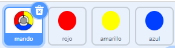
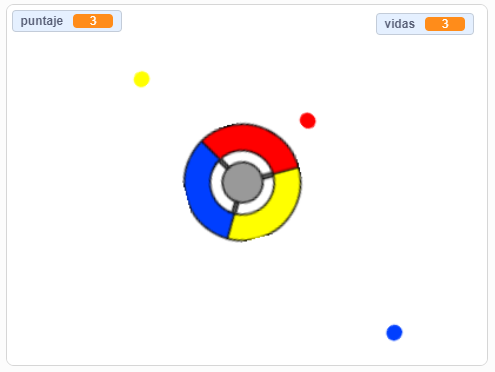

## Más puntos

\--- task \---

Duplica el objeto «rojo» dos veces y nombra a estos dos nuevos objetos «amarillo» y «azul».



\--- /task \---

\--- task \---

Cambia el disfraz de cada nuevo sprite para que tenga el color correcto: el objeto «amarillo» debe ser amarillo, y el objeto «azul» debe ser azul.

\--- /task \---

\--- task \---

Cambia el código de cada objeto para que el jugador obtenga puntos al hacer coincidir cada punto clonado con el color correcto en el mando.



\--- hints \---

\--- hint \---

Este es el código que necesitas encontrar y modificar para los nuevos objetos:


```blocks3
    if <touching color [#FF0000]?> then
        change [score v] by (1)
        play sound (pop v)
        ...
    end
```

\--- /hint \---

\--- hint \---

Así es como debes cambiar el código para el objeto amarillo:

```blocks3
    if <touching color [#FFFF00]? :: +> then
        change [score v] by (1)
        play sound (pop v)
    end
```

Así es como debes cambiar el código para el objeto azul:

```blocks3
    if <touching color [#0000FF]? :: +> then
        change [score v] by (1)
        play sound (pop v)
    end
```

\--- /hint \---

\--- /hints \---

\--- /task \---

Si juegas ahora, puedes ver que los puntos a veces se crean uno encima del otro.

\--- task \---

Cambia el código para el objeto «amarillo» para que espere cuatro segundos antes de aparecer una vez que se haga clic en la bandera.


```blocks3
    when flag clicked
    hide
+   wait (4) seconds
```


Luego, cambia el código para el objeto «azul» para que espere 6 segundos antes de aparecer una vez que se haga clic en la bandera.

\--- /task \---