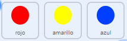

## Aumenta la dificultad

Ahora vas a hacer el juego más difícil cuanto más tiempo juegue el jugador. You will do this by making the dots appear faster and faster over time.

\--- task \---

Crea una nueva `variable`{:class = "block3variables"} llamada «retraso».


\--- /task \---

\--- task \---

Ve al área de código del escenario y crea un nuevo script que de a la variable `retraso`{: class = "block3variables"} el valor `8` y luego reduzca lentamente el valor de `retraso`{:class = "block3variables"} mientras se ejecuta el juego.


```blocks3
    when flag clicked
    set [delay v] to (8)
    repeat until < (delay) = (2)>
        wait (10) seconds
        change [delay v] by (-0.5)
    end
```

\--- /task \---

¡Observa que este código es muy similar al código que usarías para crear un temporizador de cuenta regresiva!

A continuación, utiliza la variable `retraso`{:class = "block3variables"} en el código de los objetos «rojo», «amarillo» y «azul».

\--- task \---

Elimina el bloque de código que hace que el juego espere un número aleatorio de segundos entre los clones de los puntos. Reemplaza el bloque que has eliminado con tu nueva variable `retraso`{:class="block3variables"}:



```blocks3
<br />-   wait (pick random (5) to (10)) secs
    wait (delay :: variables) secs
```

Haz esto para los tres objetos punto.

\--- /task \---

\--- task \---

Prueba el juego y verifica que los puntos comiencen a aparecer más rápido a medida que avanza el juego.

+ ¿Funciona para los tres puntos de colores?
+ ¿Puedes ver que el valor de la variable `retraso`{:class= "block3variables"} disminuye?

\--- /task \---