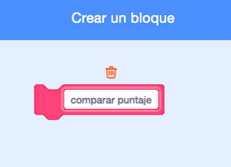

## Mejor puntaje

Vas a guardar la puntuación más alta del juego, para que los jugadores puedan ver qué tan bien juegan.

--- task ---

Crea una nueva variable llamada `mejor puntaje`{:class="block3variables"}.


--- /task ---

--- task ---

Selecciona el escenario. Haz clic en «Mis bloques» y crea un nuevo bloque personalizado llamado `comparar puntaje`{:class="block3myblocks"}.




--- /task ---

--- task ---

Agrega código a tu bloque personalizado para que el bloque verifique si el valor actual de `puntaje`{:class="block3variables"} es mayor que el valor de la variable `mejor puntaje`{:class="block3variables"} y luego almacena el valor de `puntaje`{:class="block3variables"} como el nuevo valor de `mejor puntaje`{:class="block3variables"}.


```blocks3
    define comparar puntaje
    if <(puntaje :: variables) > (mejor puntaje)> then
        set [mejor puntaje v] to (puntaje :: variables)
    end
```

--- /task ---

--- task ---

Agrega tu nuevo bloque personalizado al código del escenario antes del final del código.


```blocks3
when flag clicked
set [vidas v] to (3)
set [punatje v] to (0)
wait until <(vidas) < (1)>
+ comparar puntaje :: custom
stop [all v]
```

--- /task ---

--- task ---

Juega dos veces para comprobar si tu puntuación se guarda correctamente como el `mejor puntaje`{:class="block3variables"}.

--- /task ---