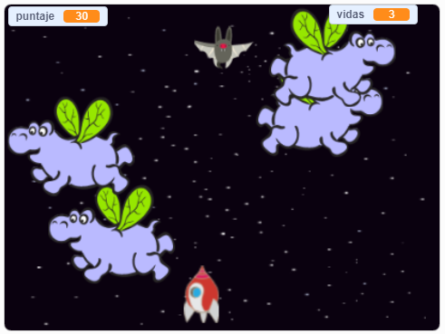

## ¿Qué sigue?

Prueba el proyecto [Guerra de clones](https://projects.raspberrypi.org/es-LA/projects/clone-wars?utm_source=pathway&utm_medium=whatnext&utm_campaign=projects) para hacer un juego en el cual tienes que salvar la Tierra de los monstruos del espacio. En ese proyecto, ¡podrás usar lo que has aprendido sobre la clonación de objetos y agregar una puntuación!

--- no-print ---

Haz clic en la bandera verde en el siguiente juego de ejemplo para comenzar y luego presiona las teclas de dirección <kbd>izquierda</kbd> y <kbd>derecha</kbd> para mover la nave espacial y la barra de <kbd>espacio</kbd> para disparar.

  <iframe allowtransparency="true" width="485" height="402" src="https://scratch.mit.edu/projects/embed/414635212/?autostart=false" frameborder="0" scrolling="no"></iframe>
  

--- /no-print ---

Consigue tantos puntos como puedas disparando a los hipopótamos voladores del espacio. Si te golpea un hipopótamo o una naranja que los murciélagos arrojan, pierdes una vida.

--- print-only ---

--- /print-only ---

***
Este proyecto fue traducido por voluntarios:

Mariela Villalobos

Verónica Valencia Límaco

Gracias a los voluntarios, podemos dar a las personas de todo el mundo la oportunidad de aprender en su propio idioma. Puedes ayudarnos a llegar a más personas ofreciéndote como voluntario para traducir. Más información en [rpf.io/translate](https://rpf.io/translate).