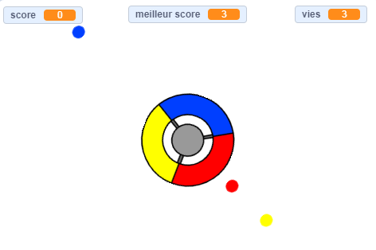

--- no-print ---

Ceci est la version **Scratch 3** du projet. Il existe également une version [Scratch 2 du projet](https://projects.raspberrypi.org/fr-FR/projects/catch-the-dots-scratch2).

--- /no-print ---

## Introduction

Dans ce projet, tu apprendras à créer un jeu dans lequel le joueur doit faire correspondre des points de couleur avec la couleur exacte de la molette du contrôleur.

--- no-print ---

Utilise les touches fléchées de ton clavier pour faire pivoter la roue du contrôleur et attraper les points volants lorsqu'ils atteignent le centre. Si tu rates trois points, le jeu est terminé.

  <iframe allowtransparency="true" width="485" height="402" src="https://scratch.mit.edu/projects/embed/397735112/?autostart=false" frameborder="0" scrolling="no"></iframe>
  

--- /no-print ---

--- print-only ---

--- /print-only ---

--- collapse ---
---
title: Ce que tu vas apprendre
---

+ Comment choisir des objets au hasard dans une liste
+ Comment utiliser des variables pour suivre la vitesse, les vies et le score du joueur

--- /collapse ---

--- collapse ---
---
title: Ce que tu auras besoin
---

### Matériel informatique

+ Un ordinateur capable d'exécuter Scratch 3

### Logiciel

+ Scratch 3 ([en ligne](http://rpf.io/scratchon){:target="_blank"} ou [hors ligne](http://rpf.io/scratchoff){:target="_blank"})

### Téléchargements

+ [Projet Scratch 2 hors ligne](http://rpf.io/p/fr-FR/catch-the-dots-go){:target="_blank"}

--- /collapse ---

--- collapse ---
---
title: Informations supplémentaires pour les éducateurs
---

--- no-print ---

Si vous avez besoin d'imprimer ce projet, merci d'utiliser la [Version imprimable](https://projects.raspberrypi.org/fr-FR/projects/catch-the-dots/print).

--- /no-print ---

Vous pouvez trouver le [projet terminé ici](http://rpf.io/p/fr-FR/catch-the-dots-get){:target="_blank"}.

Vous pouvez trouver le [projet terminé ici](https://scratch.mit.edu/projects/252923761/#editor){:target="_blank"}

--- /collapse ---