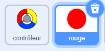
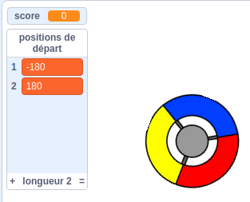
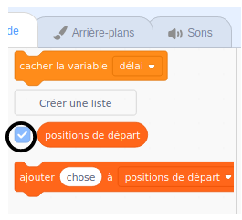

## Gagner des points ou perdre des vies

Vous allez maintenant ajouter quelques points que le joueur doit collecter.

\--- task \--- Créez un nouveau sprite appelé 'rouge'. Ce sprite devrait être un petit point rouge.



\--- /tâche \---

\--- task \--- Ajoutez ce script à votre sprite 'rouge' pour créer un nouveau clone du sprite toutes les quelques secondes:


```blocks3
    lorsque le drapeau est cliqué
    masquer
    attendre (2) secondes
    pour toujours
        créer un clone de (moi-même v)
        wait (choisir au hasard (5) à (10)) secondes
    end
```

\--- /tâche \---

Si vous cliquez sur le drapeau vert maintenant, il semble que rien ne se passe. En effet, tous les sprites clonés sont cachés et apparaissent au même endroit.

Vous allez ajouter du code pour que chaque nouveau clone apparaisse dans l'un des quatre coins de la scène.


\--- task \--- Créez une nouvelle liste appelée `positions de départ`{: class = "block3variables"}, cliquez sur l'icône `(+)` la liste pour ajouter les valeurs `-180`{: class = "block3variables" } et `180`{: class = "block3variables"}.




[[[generic-scratch3-make-list]]]

Ensuite, vous pouvez masquer la liste en désélectionnant cette case:

 \--- /tâche \---

Notez que la coordonnée pour chaque coin de la scène est une combinaison de `180` et `-180`. Cela signifie que vous pouvez utiliser la liste pour choisir au hasard un coin de la scène.

\--- task \--- Ajoutez ce code à l'image-objet 'dot' pour que chaque nouveau clone de l'image-objet apparaisse dans un coin aléatoire, puis se déplace lentement vers l'image-objet du contrôleur.


```blocks3
    quand je commence en tant que clone
    accédez à x: (élément (sélectionnez au hasard (1) à (2)) de [positions de départ v]) y: (élément (sélectionnez au hasard (1) à (2)) de [positions de départ v])
    point en direction du (contrôleur v)
    montre
    répétez jusqu'à ce que <touching (controller v)?>
        déplacent (1) étapes
    fin
```

\--- / task \--- Ce nouveau code choisit `-180` ou `180` pour les positions x et y, ce qui signifie que chaque clone de sprite 'point' commence dans un coin de la scène.

\--- tâche \--- Testez votre projet. Vous devriez voir des points rouges apparaître dans les coins de la scène et vous déplacer lentement vers le contrôleur.

 \--- /tâche \---

\--- tâche \--- Créez deux nouvelles variables appelées `vies`{: class = "block3variables"} et `notes`{: class = "block3variables"}.

 \--- /tâche \---

\--- task \--- Ajoutez du code sur votre scène pour définir la variable `lives`{: class = "block3variables"} sur `3` et les `scores`{: class = "block3variables"} sur `0` à le début du jeu. 

```blocks3
lorsque le drapeau est cliqué
régler [vies v] sur (3)
définir [score v] sur (0)
```

\--- /tâche \---

\--- task \--- Ajoutez ce code à la fin du script de la scène pour que le jeu se termine lorsque le joueur perd la fin de sa vie


```blocks3
    attendez <(vies :: variables) < [1]>
    stop [all v]
```

\--- /tâche \---

Le joueur doit gagner des points pour avoir attrapé des points et devrait perdre des vies s'il n'a pas attrapé des points. Un point ne peut être attrapé qu'en faisant correspondre la couleur du contrôleur à la couleur du point.

\--- tâche \--- Retour à la zone de sprite dot « rouge » Scripts pour ajouter des blocs de code à la fin des années l'image - objet `quand je commence comme un clone`{: class = « block3control »} script.

Tout d’abord, déplacez le clone de points `5 étapes`{: class = "block3motion"} afin qu’il chevauche le contrôleur.

Ajoutez ensuite du code pour ajouter `1` à `score`{: class = "block3variables"} si la couleur du clone de points correspond à la couleur du contrôleur quand ils se touchent, ou pour retirer `1` de `vies`{ : class = "block3variables"} si leurs couleurs ne correspondent pas.

[[[generic-scratch3-sound-from-library]]]


```blocks3
    déplacez (5) les étapes
    si <touching color [#FF0000]?> puis
        changez [score v] de (1)
        jouez le son (pop v) jusqu'à la fin
    sinon
        changez [vies v] de (-1)
        jouez le son (Laser1 v) jusqu'à la fin
    end
    supprimer ce clone
```

\--- /tâche \---

\--- tâche \---

Test your game to make sure that:

1. You lose a life if you don’t match a dot with the correct colour
2. You score a point if you match a dot correctly

\--- /tâche \---